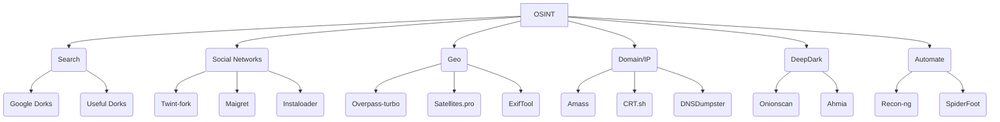

# 🕵️‍♂️ OSINT Bible 2026
> Compilation, procedures, tools and ethics for open source research
[](audit/latest.md)
[Command-line utilities](scripts/README.md) · [Link audit details](audit/latest.md)

## ⚠️ Ethical Disclaimer

This repository is dedicated to the responsible and ethical practice of Open-Source Intelligence (OSINT). All information, tools, and methodologies provided herein are intended solely for educational, research, and lawful investigative purposes. Users are strongly encouraged to adhere to ethical guidelines, respect privacy rights, comply with applicable laws and regulations, and obtain necessary permissions before conducting any investigations. Misuse of this information for illegal activities, harassment, or violation of privacy is strictly prohibited and may result in legal consequences. By accessing this repository, you agree to use the content responsibly and ethically.

---

## 🧭 Quick Index with Buttons

### Foundations
[1. Fundamentals](#1-fundamentals) | [2. 4-Step Methodology](#2-4-step-methodology) | [3. Tools Mind Map](#3-tools-mind-map) | [11. Legal Considerations](#11-legal-considerations) | [28. Professional Methodologies](#28-professional-methodologies)

### Investigation Techniques
[4. Internet Search](#4-internet-search) | [5. Social Networks](#5-social-networks) | [6. GEOINT & Images](#6-geoint--images) | [7. Domain / IP / DNS](#7-domain--ip--dns) | [15. Email/Phone Investigation](#15-emailphone-investigation) | [17. Blockchain/Crypto](#17-blockchaincrypto) | [18. Transport OSINT](#18-transport-osint) | [19. WiFi/Wardriving](#19-wifiwardriving) | [20. Content Verification](#20-content-verification) | [21. Username Enumeration](#21-username-enumeration) | [22. Web Scraping](#22-web-scraping) | [23. Metadata Extraction](#23-metadata-extraction) | [24. Network Scanning](#24-network-scanning) | [29. Advanced Google Dorks](#29-advanced-google-dorks) | [31. People Investigations](#31-people-investigations) | [32. Company Research](#32-company-research)

### Sources & Data
[8. Deep & Dark Web](#8-deep--dark-web) | [16. Data Breaches](#16-data-breaches) | [25. Dark Web](#25-dark-web) | [30. Learning Resources](#30-learning-resources) | [12. Extra Resources](#12-extra-resources)

### Frameworks & Automation
[9. Automation (Python)](#9-automation-python) | [10. Report Templates](#10-report-templates) | [13. AI Intelligence](#13-ai-intelligence) | [14. Facial Recognition](#14-facial-recognition) | [26. All-in-One Frameworks](#26-all-in-one-frameworks) | [27. Advanced Maltego](#27-advanced-maltego)

### Specialized
[33. Threat Intelligence Feeds](#33-threat-intelligence-feeds) | [34. ICS/OT & Critical-Infrastructure OSINT](#34-icsot--critical-infrastructure-osint) | [35. AI Agent Skills & MCP](#35-ai-agent-skills--mcp)

### 2026 Expansion
[36. Financial OSINT](#36-financial-osint) | [37. Investigator OPSEC & Sock Puppets](#37-investigator-opsec--sock-puppets) | [38. Cloud Storage OSINT](#38-cloud-storage-osint) | [39. Mobile App OSINT](#39-mobile-app-osint) | [40. Decentralized Social OSINT](#40-decentralized-social-osint) | [41. Counter-OSINT Self-Audit](#41-counter-osint-self-audit) | [42. Discord & Telegram OSINT 2026](#42-discord--telegram-osint-2026) | [43. Satellite OSINT 2026](#43-satellite-osint-2026) | [44. C2PA + SynthID + Deepfake Detection 2026](#44-c2pa--synthid--deepfake-detection-2026) | [45. Professional Templates & Deliverables](#45-professional-templates--deliverables) | [46. Regional OSINT](#46-regional-osint) | [47. Corporate OSINT Tradecraft](#47-corporate-osint-tradecraft) | [Appendix B. Structured Analytic Techniques](#appendix-b-structured-analytic-techniques-sats)

> [!TIP]
> **Extend OSINT-BIBLE with the companion tools that fit your workflow:**
> - **Operationalize** its methodologies with [osint-agent-skills](https://github.com/frangelbarrera/osint-agent-skills).
> - **Investigate** privately with [Abster-Intelligence](https://github.com/frangelbarrera/Abster-Intelligence).
> - **Automate** auditable workflows with [agentic-harness](https://github.com/frangelbarrera/agentic-harness).


---

## 1. Fundamentals
| Concept | Quick Definition |
|---|---|
| **OSINT** | Intelligence obtained from public sources without violating logical or physical access |
| **OPSEC** | Minimize footprint: VPN → VM → alias → metadata strip |
| **Intelligence Cycle** | Direction → Collection → Processing → Analysis → Dissemination |
| **PII** | Information that identifies: email, phone, RFC, CURP, IP, IMEI, MAC |
| **Primary Source** | Original publication (tweet, official PDF, photo EXIF) |
| **Secondary Source** | Article citing the primary (validate) |

---

## 2. 4-Step Methodology
1. **Define question** → What do I want to know?  
2. **Identify sources** → Table below |
3. **Collect** → Manual + automations |
4. **Validate and document** → Screenshots, hash, date, URL, archive.org |

| Data Type | Usual Location | Star Tool |
|---|---|---|
| Name | LinkedIn, Facebook | [Maigret](https://github.com/soxoj/maigret) |
| Email | Data breaches, newsletters | [HIBP](https://haveibeenpwned.com) |
| Phone | WhatsApp Business, TrueCaller | [Infobel](https://www.infobel.com) |
| Username | Forums, gaming, GitHub | [Snoop](https://github.com/snooppr/snoop) |
| Photo | Geolocation, EXIF | [Exiftool](https://exiftool.org) |
| Domain | WHOIS, certificates | [Amass](https://github.com/owasp-amass/amass) |
| IP | Scanning, Shodan | [Shodan](https://shodan.io) |
| Crypto wallet | Blockchain explorers | [BlockCypher](https://live.blockcypher.com) |

---

## 3. Tools Mind Map


---

## 4. Internet Search
### 4.1 Google Dorks – 20 essentials
| Objective | Dork | Example |
|---|---|---|
| Government PDFs | `site:gov filetype:pdf "contract"` | Mexico |
| Exposure | `intitle:"index of" passwords.txt` | — |
| IP Cameras | `inurl:viewer/live/index.html` | — |
| Emails | `site:linkedin.com "@company.com"` | — |
| Subdomains | `site:*.target.com -www` | — |

### 4.2 Alternative Search Engines
- [DuckDuckGo "bangs"](https://duckduckgo.com/bang) → `!archive`
- [Yandex](https://yandex.com) → best results CIS
- [Baidu](https://baidu.com) → Asia
- [Startpage](https://startpage.com) → no logs
- [Shodan](https://shodan.io) → IoT, ICS, SCADA
- [Censys](https://censys.com/) → cert + banner
- [FOFA](https://fofa.info) → China, free API
- [BinaryEdge](https://binaryedge.io) → global scanning
- [Hunter.io](https://hunter.io) → corporate emails
- [PublicWWW](https://publicwww.com) → search in source code
- [SearchCode](https://searchcode.com) → search in 75B lines of code
- [SimilarSites](https://www.similarsites.com) → similar sites
- [Netlas](https://netlas.io) → internet intelligence
- [CriminalIP](https://www.criminalip.io) → search in connected internet
- [NerdyData](https://www.nerdydata.com) → website technologies
- [GreyNoise](https://www.greynoise.io) → internet noise
- [Intezer Analyze](https://analyze.intezer.com) → malware analysis
- [Kaspersky OpenTIP](https://opentip.kaspersky.com) → threat scanning
- [VirusTotal](https://virustotal.com) → file/URL analysis
- [AlienVault OTX](https://otx.alienvault.com) → threat exchange
- [ExploitDB](https://www.exploit-db.com) → exploit database
- [MalwareBazaar](https://bazaar.abuse.ch) → malware samples
- [Malware Domain List](https://www.malwarepatrol.net) → malicious domains
- [PhishTank](https://www.phishtank.com) → phishing URLs
- [URLhaus](https://urlhaus.abuse.ch) → malware URLs
- [YARAify](https://yaraify.abuse.ch) → YARA rules
- [PulseDive](https://pulsedive.com) → IOC search
- [ThreatFox](https://threatfox.abuse.ch) → malware IOCs
- [Breach Directory](https://breachdirectory.org) → breach searches
- [Have I Been Pwned](https://haveibeenpwned.com) → breach verification
- [DNSViz](https://dnsviz.net) → DNSSEC visualization
- [DNSdumpster](https://dnsdumpster.com) → DNS enumeration
- [SpyOnWeb](https://spyonweb.com) → related sites
- [Yark](https://github.com/Owez/yark) → archive YouTube
- [CovertAction](https://covertactionmagazine.com) → investigative journalism
- [Trellix Research](https://www.trellix.com/en-us/about/newsroom/stories/research.html) → threat research
- [CP Research](https://research.checkpoint.com) → Checkpoint research
- [Wikistrat](https://www.wikistrat.com/blog) → collaborative analysis
- [PolySwarm](https://polyswarm.network) → threat scanning
- [HackerOne Hacktivity](https://hackerone.com/hacktivity) → public vulnerabilities
- [WikiLeaks](https://wikileaks.org) → leaked documents
- [Talos Reports](https://talosintelligence.com/vulnerability_reports) → vulnerability reports
- [MalAPI](https://malapi.io) → malware APIs
- [UserSearch](https://usersearch.org) → user search
- [SecureList](https://securelist.com) → Kaspersky blog
- [SPLC Hate Map](https://www.splcenter.org/hate-map) → hate map
- [ICSR](https://icsr.info) → radicalization studies
- [Militant Wire](https://www.militantwire.com) → militancy analysis
- [START Publications](https://www.start.umd.edu/publications) → terrorism publications
- [SPLC Resources](https://www.splcenter.org/resources) → SPLC resources
- [Tracking Terrorism](https://trackingterrorism.org) → terrorism tracking
- [Mapping Militants](https://mappingmilitants.org/) → mapping militants
- [Naval Institute](https://news.usni.org) → naval news
- [Institute of International Relations](https://www.iir.cz/en) → international relations
- [Janes](https://www.janes.com) → defense intelligence
- [TASS News](https://tass.com) → Russian news
- [Sputnik News](https://sputnikglobe.com) → Sputnik news
- [PIPS](https://www.pakpips.com) → Pakistan peace studies
- [PICSS](https://www.picss.net) → Pakistan conflict studies
- [Reuters](https://www.reuters.com) → news agency
- [RT](https://rt.com) → Russia Today
- [InternetActivism](https://internetactivism.org) → humanitarian tools
- [IISS](https://iiss.org) → international studies institute
- [CFR](https://cfr.org/newsletters) → council on foreign relations
- [SciHub](https://sci-hub.ru) → access to scientific papers
- [ResearchHub](https://www.researchhub.com) → research discussion
- [IDCrawl](https://www.idcrawl.com) → people search
- [Osint Industries](https://osint.industries) → email/phone search
- [ESPY](https://espysys.com/) → phone search
- [SUNDERS](https://sunders.uber.space) → surveillance cameras
- [Deepinfo](https://deepinfo.com) → internet intelligence
- [Session](https://getsession.org) → private messaging
- [Consortium News](https://consortiumnews.com) → independent journalism
- [Tutanota](https://tuta.com/) → encrypted email
- [Committee to Protect Journalists](https://cpj.org) → journalist protection
- [SecurityWeek](https://www.securityweek.com) → security news
- [NCRI](https://networkcontagion.us) → network contagion research
- [Geopolitical Economy Report](https://geopoliticaleconomy.com) → geopolitical reports
- [The Grayzone](https://thegrayzone.com) → independent journalism
- [FlightAware](https://www.flightaware.com) → flight tracking
- [FlightRadar24](https://www.flightradar24.com) → flight radar
- [MarineTraffic](https://www.marinetraffic.com) → maritime traffic
- [VesselFinder](https://www.vesselfinder.com) → ship search
- [NewspaperArchive](https://newspaperarchive.com) → newspaper archives
- [The Indian Express](https://indianexpress.com) → Indian news
- [Daily Excelsior](https://www.dailyexcelsior.com/) → Jammu Kashmir news
- [DNA India](https://www.dnaindia.com) → Indian news
- [Greater Kashmir](https://www.greaterkashmir.com) → Kashmir news
- [Nagaland Post](https://www.nagalandpost.com) → Nagaland news
- [RFE/RL](https://www.rferl.org) → Radio Free Europe
- [Akto](https://www.akto.io) → API security
- [Generated Photos](https://generated.photos) → AI photos
- [HDRobots](https://hdrobots.com) → AI tools directory
- [Channel 4 News](https://www.channel4.com/news) → British news
- [ThreatMon Reports](https://threatmon.io/reports) → threat reports
- [Israel Datasets](https://data.gov.il/) → Israeli datasets
- [AI Dubbing](https://elevenlabs.io/dubbing) → AI dubbing
- [Budget Key](https://next.obudget.org/?lang=en) → Israel budget
- [Ship Spotting](https://www.shipspotting.com) → ship photos
- [Broadcastify](https://www.broadcastify.com) → police audio
- [OpenCelliD](https://www.opencellid.org) → cell tower database
- [AviationStack](https://aviationstack.com) → aviation API
- [DocumentCloud](https://www.documentcloud.org/documents/) → document management
- [IDRW](https://idrw.org) → Indian defense
- [XFE](https://exchange.xforce.ibmcloud.com) → X-Force exchange
- [Scumware](https://www.scumware.org) → malware research
- [Ukraine Live Cams](https://nagix.github.io/ukraine-livecams) → Ukraine cameras
- [TWN](http://www.the-webcam-network.com) → webcam network
- [Opentopia](https://www.opentopia.com/) → public webcams
- [Transparency](https://www.transparency.org) → anti-corruption
- [Maigret](https://github.com/soxoj/maigret) → user search
- [OCCRP](https://www.occrp.org/en) → organized crime
- [Qdorks](https://qsourcer.com/qdorks) → dork generator
- [Radio Garden](https://radio.garden) → world radios
- [LolArchiver OSINT](https://osint.lolarchiver.com) → OSINT search
- [BreachBase](https://breachbase.com) → breach base
- [WorldCam](https://worldcam.eu) → world webcams
- [Webcam Galore](https://www.webcamgalore.com) → webcams
- [WiFi Map](https://www.wifimap.io) → WiFi hotspots
- [OpenTrafficCamMap](https://otc.armchairresearch.org/map) → traffic cameras
- [Skyline Webcams](https://www.skylinewebcams.com/en/webcam) → skyline webcams
- [Pictimo](https://www.pictimo.com) → world webcams
- [Instances.social](https://instances.social) → Mastodon recommender
- [CamHacker](https://www.camhacker.com) → public webcams
- [Labs TIB Geoestimation](https://labs.tib.eu/geoestimation) → geographic estimation
- [Picarta](https://picarta.ai) → photo location prediction
- [Tiny Scan](https://www.tiny-scan.com) → URL scanning
- [ZeroDay](https://www.cybersecurity-help.cz/vdb/zero-days/) → zero-day vulnerabilities
- [Predicta Search](https://predictasearch.com) → digital search
- [Ventusky](https://www.ventusky.com) → weather maps
- [OSV](https://osv.dev) → open source vulnerabilities
- [Coalition ESS](https://ess.coalitioninc.com) → exploit scoring
- [Validin](https://app.validin.com) → attack surface mapping
- [CIRCL PDNS](https://www.circl.lu/services/passive-dns) → passive DNS
- [InTheWild](https://github.com/gmatuz/inthewilddb) → exploits in wild
- [360 Quake](https://quake.360.net) → cyberspace mapping
- [Cloudflare Radar](https://radar.cloudflare.com/traffic) → internet trends
- [Crisis24](https://crisis24.garda.com) → security risk management
- [arXiv](https://arxiv.org) → scientific papers

### 4.2.1 Verified addition (2026-09)

| Resource | Stars | Last push | What it adds |
|---|---|---|---|
| [awesome-censys-queries](https://github.com/thehappydinoa/awesome-censys-queries) | 1,244 | 2026-07 | Curated set of non-obvious Censys queries for asset discovery |

### 4.3 Archives and snapshots
- [Wayback Machine](https://archive.org/web)
- [CachedView](https://cachedview.com) (Google + Archive.is)
- [URLScan](https://urlscan.io) → capture + DOM + requests
- [Ubikron](https://ubikron.com ) → AI-powered evidence collection & entity extraction
- [Screenshot Guru](https://screenshot.guru) → screen test
- [Stored Website](https://stored.website) → cached pages
- [YARAify](https://yaraify.abuse.ch) → YARA rules
- [PulseDive](https://pulsedive.com) → IOC search
- [ThreatFox](https://threatfox.abuse.ch) → malware IOCs
- [Breach Directory](https://breachdirectory.org) → breaches
- [Have I Been Pwned](https://haveibeenpwned.com) → breach verification
- [DNSViz](https://dnsviz.net) → DNSSEC
- [DNSdumpster](https://dnsdumpster.com) → DNS enumeration
- [SpyOnWeb](https://spyonweb.com) → related sites
- [Yark](https://github.com/Owez/yark) → archive YouTube

---

## 5. Social Networks
### 5.1 Facebook
1. **Facebook Recover Lookup** - Link: [Facebook Recover Lookup](https://www.facebook.com/login/identify?ctx=recover) *(requires a logged-in session)* - Description: Used to check if a given email or phone number is associated with any Facebook account or not.
2. **Social Searcher** - Link: [Social Searcher](https://www.social-searcher.com/) - Description: Allows you to monitor all public social mentions in social networks and the web.
3. **Lookup-id.com** - Link: [Lookup-id.com](https://lookup-id.com/) - Description: Helps you find the Facebook ID of anyone's profile or a Group.
4. **Who posted this** - Link: [Who posted this](https://whopostedwhat.com/) - Description: Facebook keyword search for people who work in the public interest. It allows you to search keywords on specific dates.
5. **Facebook Search** - Link: [Facebook Search](https://www.sowsearch.info/) - Description: Allows you to search on Facebook for posts, people, photos, etc., using some filters.
6. **Facebook Graph Searcher** - Link: [Facebook Graph Searcher](https://intelx.io/tools) - Description: To search someone on Facebook.
7. **Facebook People Search** - Link: [Facebook People Search](https://www.facebook.com/directory/people/) *(HTTP 400 from automated link checks; confirm availability in a browser)* - Description: Search on Facebook by victim's name.
8. **DumpItBlue** - Link: [DumpItBlue+](https://chromewebstore.google.com/detail/dumpitblue+/igmgknoioooacbcpcfgjigbaajpelbfe) - Description: helps to dump Facebook stuff for analysis or reporting purposes.
9. **Export Comments** - Link: [Export Comments](https://exportcomments.com/) - Description: Easily exports all comments from your social media posts to Excel file.
10. **Facebook Applications** - Link: [Facebook Applications](https://khalil-shreateh.com/khalil.shtml/social_applications/facebook-applications/) - Description: A collection of online tools that automate and facilitate Facebook.
11. **Social Analyzer** - Link: [SocialAnalyzer - Social Sentiment & Analysis](https://chromewebstore.google.com/detail/socialanalyzer-social-sen/efeikkcpimdfpdlmlbjdecnmkknjcfcp) - Description: a free tool of social media monitoring and analysis.
12. **AnalyzeID** - Link: [AnalyzeID](https://analyzeid.com/) - Description: Just looking for sites that supposedly may have the same owner. Including a FaceBook App ID match.
13. **SOWsearch** - Link: [sowsearch](https://www.sowsearch.info/) - Description: a simple interface to show how the current Facebook search function works.
14. **Facebook Matrix** - Link: [FacebookMatrix](https://plessas.net/facebookmatrix) - Description: Formulas for Searching Facebook.
15. **Who posted what** - Link: [Who Posted What](https://whopostedwhat.com/) - Description: A non public Facebook keyword search for people who work in the public interest. It allows you to search keywords on specific dates.
16. **StalkFace** - Link: [StalkFace](https://stalkface.com/en/) - Description: Toolkit to stalk someone on Facebook.
17. **Search is Back** - Link: [Search is Back](https://searchisback.com/) - Description: ind people and events on Facebook Search by location, relationships, and more!.
18. **FB-Search** - Link: [FB-Search](https://fb-search.com) - Description: busca por teléfono o correo.
19. **FB-Posts-scraper** - Link: [FB-Posts-scraper](https://github.com/rugantio/fbcrawl) - Description: (Python).
20. **FB-Video-downloader** - Link: [FB-Video-downloader](https://fdown.net) - Description: .

### 5.2 Instagram
1. **IFTTT Integrations** - Link: [IFTTT Instagram integrations](https://ifttt.com/instagram) - Description: Popular Instagram workflows & automations.
2. **IMGinn.io** - Link: [IMGinn.io](https://imginn.io/) - Description: view and download all the content on the social network Instagram all at one place.
3. **Instaloader** - Link: [Instaloader](https://github.com/instaloader/instaloader) - Description: Download pictures (or videos) along with their captions and other metadata from Instagram.
4. **SolG** - Link: [SolG](https://github.com/yezz123/SoIG) - Description: The Instagram OSINT Tool gets a range of information from an Instagram account that you normally wouldn't be able to get from just looking at their profile.
5. **Osintgram** - Link: [Osintgram](https://github.com/Datalux/Osintgram) - Description: Osintgram is an OSINT tool on Instagram to collect, analyze, and run reconnaissance.
6. **Toutatis** - Link: [toutatis](https://pypi.org/project/toutatis/) - Description: It is a tool written to retrieve private information such as Phone Number, Mail Address, ID on Instagram accounts via API.
7. **instalooter** - Link: [instalooter](https://pypi.org/project/instalooter/) - Description: InstaLooter is a program that can download any picture or video associated from an Instagram profile, without any API access.
8. **Exportgram** - Link: [Exportgram](https://exportgram.net/) - Description: A web application made for people who want to export instagram comments into excel, csv and json formats.
9. **Profile Analyzer** - Link: [Profile Analyzer](https://inflact.com/tools/profile-analyzer/) - Description: Analyze any public profile on Instagram – the tool is free, unlimited, and secure. Enter a username to take advantage of precise statistics.
10. **Find Instagram User Id** - Link: [Find Instagram User Id](https://www.codeofaninja.com/tools/find-instagram-user-id/) - Description: This tool called "Find Instagram User ID" provides an easy way for developers and designers to get Instagram account numeric ID by username.
11. **Instahunt** - Link: [Instahunt](https://instahunt.huntintel.io/) - Description: Easily find social media posts surrounding a location.
12. **Musicaldown** - Link: [Musicaldown](https://musicaldown.com) - Description: web.

### 5.3 LinkedIn
1. **RecruitEm** - Link: [RecruitEm](https://recruitin.net/) - Description: Allows you to search social media profiles. It helps recruiters to create a Google boolean string that searches all public profiles.
2. **RocketReach** - Link: [RocketReach](https://rocketreach.co/person) - Description: Allows you to programmatically search and lookup contact info over 700 million professionals and 35 million companies.
3. **Phantom Buster** - Link: [Phantom Buster](https://phantombuster.com/phantombuster) - Description: Automation tool suite that includes data extraction capabilities.
4. **linkedprospect** - Link: [LinkedIn Boolean Search](https://linkedprospect.com/linkedin-boolean-search-tool/#tool) - Description: Build a targeted list of LinkedIn people using boolean search.
5. **ReverseContact** - Link: [Reverse Email Lookup](https://www.reversecontact.com/) - Description: Find Linked Profiles associated with any email.
6. **LinkedIn Search Engine** - Link: [Programmable Search Engine](https://cse.google.com/cse?cx=daaf18e804f81bed0) - Description: Programmable Search Engine for LinkedIn profiles.
7. **Free People Search Tool** - Link: [Free People Search Tool](https://freepeoplesearchtool.com/#gsc.tab=0) - Description: Find people easily online.
8. **IntelligenceX Linkedin** - Link: [IntelligenceX Linkedin](https://intelx.io/tools) - Description: A webbased tool for searching someone on Linkedin.
9. **Linkedin Search Tool** - Link: [Linkedin Search Tool](https://inteltechniques.com/tools/Linkedin.html) - Description: Provides you a interface with various tools for Linkedin Osint.
10. **LinkedInt** - Link: [LinkedInt](https://github.com/vysecurity/LinkedInt) - Description: Providing you with Linkedin Intelligence.
11. **InSpy** - Link: [InSpy](https://github.com/jobroche/InSpy) - Description: InSpy is a python based LinkedIn enumeration tool.
12. **CrossLinked** - Link: [CrossLinked](https://github.com/m8sec/CrossLinked) - Description: CrossLinked is a LinkedIn enumeration tool that uses search engine scraping to collect valid employee names from an organization.
13. **Hunter.io** - Link: [Hunter.io](https://hunter.io) - Description: Find and verify corporate email patterns. 25 free searches per month.

### 5.4 Twitter/X
1. **TweetDeck** - Link: [TweetDeck](https://tweetdeck.twitter.com/) - Description: Offers a more convenient Twitter experience by allowing you to view multiple timelines in one easy interface.
2. **FollowerWonk** - Link: [FollowerWonk](https://followerwonk.com/bio) - Description: Helps you find Twitter accounts using bio and provides many other useful features.
3. **Twitter Advanced Search** - Retired endpoint; use the native search tools at [X](https://x.com/) and verify availability in a browser.
4. **memory.lol** - Link: [memory.lol](https://memory.lol/app/) - Description: a tiny web service that provides historical information about twitter users.
5. **SocialData API** - Link: [SocialData API](https://socialdata.tools/) - Description: an unofficial Twitter API alternative that allows scraping historical tweets, user profiles, lists and Twitter spaces without using Twitter's API.
6. **Social Bearing** - Link: [Social Bearing](https://socialbearing.com/) - Description: Insights & analytics for tweets & timelines.
7. **Tinfoleak** - Link: [Tinfoleak](https://tinfoleak.com/) - Description: Search for Twitter users leaks.
8. **Network Tool** - Link: [Network Tool](https://osome.iu.edu/tools/networks/) - Description: Explore how information spreads across Twitter with an interactive network using OSoMe data.
9. **Foller** - Link: [Foller](https://foller.me/) - Description: Looking for someone in the United States? Our free people search engine finds social media profiles, public records, and more!
10. **SimpleScraper OSINT** - Link: [SimpleScraper OSINT](https://airtable.com/appyDhNeSetZU0rIw/shrceHfvukijgln9q/tblxgilU0SzfXNEwS/viwde4ACDDOpeJ8aO?blocks=bipxY3tKD5Lx0wmEU) - Description: This Airtable automatically scrapes OSINT-related twitter accounts ever 3 minutes and saves tweets that contain coordinates.
11. **Deleted Tweet Finder** - Link: [Deleted Tweet Finder](https://cache.digitaldigging.org/) - Description: Search for deleted tweets across multiple archival services.
12. **Twitter Search Tool** - Link: [Twitter search tool](https://www.aware-online.com/en/osint-tools/twitter-search-tool/) - Description: On this page you can create advanced search queries within Twitter.
13. **Twitter Video Downloader** - Link: [Twitter Video Downloader](https://twittervideodownloader.com/) - Description: Download Twitter videos & GIFs from tweets.
14. **Download Twitter Data** - Link: [Download Twitter Data](https://www.twtdata.com/) - Description: Download Twitter data in csv format by entering any Twitter handle, keyword, hashtag, List ID or Space ID.
15. **Twitonomy** - Link: [Twitonomy](https://www.twitonomy.com/) - Description: Twitter #analytics and much more.
16. **tweeterid** - Link: [tweeterid](https://tweeterid.com/) - Description: Type in any Twitter ID or @handle below, and it will be converted into the respective ID or username.
17. **BirdHunt** - Link: [BirdHunt](https://birdhunt.huntintel.io/) - Description: Easily find social media posts surrounding a location.
18. **Twint-docker** - Link: [Twint-docker](https://github.com/twintproject/twint) - Description: Download all tweets from a user without API access.
19. **Sentiment140** - Link: [Sentiment140](http://sentiment140.com) - Description: Bulk sentiment analysis for tweets via CSV.
20. **Xquik** - Link: [Xquik](https://xquik.com) - Description: 122 API endpoints for search, user, post and monitor. API key, USD 0.00015/read.
21. **TwiFlux** - Link: [TwiFlux](https://twiflux.com) - A collection of browser-based tools for Twitter/X, including video, image, tweet and thread downloaders, format converters, search tools, and other utilities. 

### 5.5 Pinterest
1. **DownAlbum** - Link: [DownAlbum](https://chromewebstore.google.com/detail/downalbum/cgjnhhjpfcdhbhlcmmjppicjmgfkppok) - Description: Google Chrome extension for downloading albums of photos from various websites, including Pinterest.
2. **Experts PHP: Pinterest Photo Downloader** - Link: [Pinterest Photo Downloader](https://www.expertsphp.com/pinterest-photo-downloader.html) - Description: Website providing a tool to download photos from Pinterest.
3. **Pingroupie** - Link: [Pingroupie](https://pingroupie.com/) - Description: A Meta Search Engine for Pinterest that lets you discover Collaborative Boards, Influencers, Pins, and new Keywords.
4. **Tailwind** - Link: [Tailwind](https://www.tailwindapp.com) - Description: Social media scheduling and management tool that supports Pinterest.
5. **Pinterest Guest** - Link: [Pinterest Guest](https://addons.mozilla.org/en-US/firefox/addon/pinterest-guest) - Description: Mozilla Firefox add-on for browsing Pinterest without logging in or creating an account.

### 5.6 Reddit
1. **F5BOT** - Link: [F5BOT](https://f5bot.com) - Description: Receive notifications for new Reddit posts matching specific keywords.
2. **Mostly Harmless** - Link: [Mostly Harmless](http://kerrick.github.io/Mostly-Harmless/#features) - Description: A suite of tools for Reddit, including user analysis, subreddit comparison, and more.
3. **OSINT Combine: Reddit Post Analyzer** - Link: [OSINT Combine: Reddit Post Analyzer](https://www.osintcombine.com/tools) - Description: Analyze and gather information from Reddit posts for OSINT purposes.
4. **Phantom Buster** - Link: [Phantom Buster](https://phantombuster.com/phantombuster?category=reddit) - Description: Automation tool suite that includes Reddit data extraction capabilities.
5. **rdddeck** - Link: [rdddeck](https://rdddeck.com) - Description: Real-time dashboard for monitoring multiple Reddit communities.
6. **Readr for Reddit** - Link: [Readr for Reddit](https://chromewebstore.google.com/detail/readr-for-reddit/molhdaofohigaepljchpmfablknhabmo) - Description: Google Chrome extension for an improved reading experience on Reddit.
8. **Reddit Comment Search** - Link: [Reddit Comment Search](https://redditcommentsearch.com) - Description: Search for specific comments and conversations on Reddit.
9. **Redditery** - Link: [Redditery](https://www.redditery.com/) - Description: Explore Reddit posts and comments based on various criteria.
10. **Reddit Hacks** - Link: [Reddit Hacks](https://github.com/EdOverflow/hacks) - Description: Collection of Reddit hacks and tricks for advanced users.
11. **Reddit List** - Link: [Reddit List](https://redditlist.com/) - Description: Directory of popular subreddits organized by various categories.
12. **reddtip** - Link: [reddtip](https://www.redditp.com) - Description: Show appreciation to Reddit users by sending them tips in cryptocurrencies.
13. **Reddit Search** - Link: [Reddit Search (realsrikar)](https://realsrikar.github.io/reddit-search) - Description: Various tools and websites for searching and discovering content on Reddit.
15. **Reddit Stream** - Link: [Reddit Stream](http://reddit-stream.com) - Description: Live-streaming of Reddit comments for real-time discussions.
16. **Reddit Suite** - Link: [Reddit Enhancement Suite (Chrome Extension)](https://chromewebstore.google.com/detail/reddit-enhancement-suite/kbmfpngjjgdllneeigpgjifpgocmfgmb) - Description: Browser extension that enhances the Reddit browsing experience with additional features.
17. **Reddit User Analyser** - Link: [Reddit User Analyser](https://atomiks.github.io/reddit-user-analyser) - Description: Analyze and visualize the activity and behavior of Reddit users.
19. **Reditr** - Link: [Reditr](http://reditr.com) - Description: Desktop Reddit client with a clean and intuitive interface.
20. **Reeddit** - Link: [Reeddit](https://reedditapp.com) - Description: Simplified and clean Reddit web interface for a distraction-free browsing experience.
21. **smat** - Link: [smat](https://www.smat-app.com/timeline) - Description: Social media analytics tool that includes Reddit for tracking trends and engagement.
22. **socid_extractor** - Link: [socid_extractor](https://github.com/soxoj/socid_extractor) - Description: Extract user information from Reddit and other social media platforms.
23. **Suggest me a subreddit** - Link: [Suggest me a subreddit](https://nikas.praninskas.com/suggest-subreddit) - Description: Get recommendations for new subreddits to explore based on your preferences.
24. **Subreddits** - Link: [Subreddits](http://subreddits.org) - Description: Directory of active subreddits organized by various categories.
25. **uforio** - Link: [uforio](http://uforio.com) - Description: Generate word clouds from Reddit comment threads.
26. **Universal Reddit Scraper (URS)** - Link: [Universal Reddit Scraper (URS)](https://github.com/JosephLai241/URS) - Description: Python-based tool for scraping Reddit data for analysis.
27. **Vizit** - Link: [Vizit](https://redditstuff.github.io/sna/vizit) - Description: Visualize and analyze relationships between Reddit users and subreddits.
28. **Wisdom of Reddit** - Link: [Wisdom of Reddit](https://wisdomofreddit.com) - Description: Curated collection of insightful quotes and comments from Reddit.

### 5.7 Github Leak Detection
1. **Awesome Lists** - Link: [Awesome Lists](https://awesomelists.calvinjeng.io/) - Description: A curated list of awesome lists for various programming languages, frameworks, and tools.
2. **CoderStats** - Link: [CoderStats](https://coderstats.net) - Description: A platform for developers to track and showcase their coding activity and statistics from GitHub.
3. **Digital Privacy** - Link: [Digital Privacy](https://github.com/ffffffff0x/Digital-Privacy) - Description: A collection of resources and tools for enhancing digital privacy and security.
4. **Find Github User ID** - Link: [Find Github User ID](http://caius.github.io/github_id) - Description: A web tool for finding the unique identifier (ID) of a GitHub user.
5. **GH Archive** - Link: [GH Archive](http://www.gharchive.org) - Description: A project that provides a public dataset of GitHub activity, including events and metadata.
9. **Github Dorks** - Link: [Github Dorks](https://github.com/techgaun/github-dorks) - Description: A collection of GitHub dorks, which are search queries to find sensitive information in repositories.
10. **Github Stars** - Link: [Github Stars](http://githubstars.com) - Description: A website that showcases GitHub repositories with the most stars and popularity.
11. **Github Trending RSS** - Link: [Github Trending RSS](https://mshibanami.github.io/GitHubTrendingRSS) - Description: An RSS feed generator for trending repositories on GitHub.
12. **Github Username Search Engine** - Link: [Github Username Search Engine](https://jonnygovish.github.io/Github-username-search-engine) - Description: A search engine to find GitHub usernames based on various filters and criteria.
13. **Github Username Search Engine** - Link: [Github Username Search Engine](https://githubnotes-47071.firebaseapp.com/#/?_k=n0bgxn) - Description: Another search engine to find GitHub usernames with advanced filtering options.
14. **GitHut** - Link: [GitHut](https://githut.info) - Description: A website that provides statistics and visualizations of programming languages on GitHub.

#### 5.7.x.1 Verified Tools

| Tool | URL | Function |
|---|---|---|
| GitGot | https://github.com/BishopFox/GitGot | GitHub repo audit |
| gitGraber | https://github.com/hisxo/gitGraber | GitHub secrets search |
| GitHound | https://github.com/tillson/git-hound | Sensitive info search |
| TruffleHog | https://github.com/trufflesecurity/trufflehog | Credential detection with verification |
| Gitleaks | https://github.com/gitleaks/gitleaks | Fast secrets detection |

#### 5.7.x.2 GitHub Dorks — 15 Practical Examples

```text
1.  ORGNAME filename:.env AWS_SECRET_ACCESS_KEY
2.  ORGNAME filename:.env MAIL_PASSWORD
3.  ORGNAME filename:.npmrc _auth
4.  ORGNAME filename:.dockercfg
5.  ORGNAME filename:config.rb password
6.  ORGNAME filename:id_rsa BEGIN OPENSSH PRIVATE KEY
7.  ORGNAME filename:id_dsa BEGIN DSA PRIVATE KEY
8.  ORGNAME extension:pem PRIVATE KEY
9.  ORGNAME filename:.git-credentials
10. ORGNAME filename:settings.py SECRET_KEY
11. ORGNAME filename:wp-config.php DB_PASSWORD
12. ORGNAME filename:database.yml password
13. ORGNAME "api.openai.com" Authorization:Bearer
14. ORGNAME extension:sh AWS_ACCESS_KEY_ID
15. ORGNAME filename:terraform.tfvars
```

**Variations:** `fork:true` to include forks · `archived:true` for archived repos · `pushed:>2026-01-01` for recent.

#### 5.7.x.3 Tool Workflows

**TruffleHog** (active credential verification):

```bash
# Install
go install github.com/trufflesecurity/trufflehog/v3@latest

# Scan repo with full history:
trufflehog git <REPOSITORY_URL> --only-verified

# Scan organisation:
trufflehog github --org=ORGNAME --only-verified

# JSON output:
trufflehog git <REPOSITORY_URL> --json --only-verified > findings.json
```

The `--only-verified` flag filters only secrets confirmed active. Reduces false positives.

**gitGraber** (continuous monitoring in cron):

```bash
git clone https://github.com/hisxo/gitGraber.git
cd gitGraber

# Configure config.py with GITHUB_TOKENS, WORDLIST, SLACK_WEBHOOK

# First run:
python3 gitGraber.py --wordlist wordlists/your_wordlist.txt --output

# Cron every 6h:
# 0 */6 * * * cd /opt/gitGraber && python3 gitGraber.py --wordlist ...
```

**GitGot** (interactive audit):

```bash
pip install gitgot
python3 gitgot.py -q "ORGNAME"
# Interactive session: [i]gnore, [s]ave, [r]eview, [q]uit
```

#### 5.7.x.4 Ethical Considerations

- **Accessing a public repo is legitimate.** GitHub public is public.
- **NOT legitimate:** using a found secret to escalate access. The difference between defensive OSINT and attack is **use, not access**.
- **Responsible disclosure:** discovering a leak obliges you to notify the repo owner. 90 days before public disclosure (Project Zero standard).
- **Do not include the full secret in the client report.** Format `ghp_••••••[last4]`.
- **GitHub Security Advisory** for leaks in third-party repos.


### 5.8 Snapchat
1. **addmeContacts** - Link: [addmeContacts](http://add-me-contacts.com) - Description: A platform to find and connect with new contacts on various social media platforms.
3. **ChatToday** - Link: [ChatToday](https://chattoday.com) - Description: An online chat platform for connecting and chatting with people from around the world.
4. **Gebruikersnamen: Snapchat** - Link: [Gebruikersnamen: Snapchat](https://gebruikersnamen.nl/snapchat) - Description: A website for finding Snapchat usernames.
5. **OSINT Combine: Snapchat MultiViewer** - Link: [OSINT Combine: Snapchat MultiViewer](https://www.osintcombine.com/snapchat-multi-viewer) - Description: A tool for viewing multiple Snapchat accounts simultaneously.
6. **Snapchat-mapscraper** - Link: [Snapchat-mapscraper](https://github.com/nemec/snapchat-map-scraper) - Description: A tool for scraping public Snapchat Stories from the Snap Map.
7. **Snap Political Ads Library** - Link: [Snap Political Ads Library](https://www.snap.com/en-GB/political-ads) - Description: Snapchat's library of political ads displayed on the platform.
8. **Social Finder** - Link: [Social Finder](https://socialfinder.app) - Description: A platform to search and discover social media profiles on various platforms.
9. **SnapIntel** - Link: [SnapIntel](https://github.com/Kr0wZ/SnapIntel) - Description: a python tool providing you information about Snapchat users.
10. **AddMeS** - Link: [AddMeS](https://addmes.io/) - Description: The 'Add Me' directory of Snapchat users on web.

### 5.9 WhatsApp
1. **checkwa** - Link: [checkwa](https://checkwa.online) - Description: An online tool to check the status and availability of WhatsApp numbers.
2. **WhatsApp Fake Chat** - Link: [WhatsApp Fake Chat](http://www.fakewhats.com/generator) - Description: An online tool to generate fake WhatsApp conversations for fun or pranks.
3. **whatsfoto** - Link: [whatsfoto](https://github.com/zoutepopcorn/whatsfoto) - Description: A Python script to download profile pictures from WhatsApp contacts.
4. **CheckLeaked WhatsApp** - Link: [CheckLeaked WhatsApp](https://whatsapp.checkleaked.cc) - Description: An online tool to look up WhatsApp numbers — download the current and historical profile pictures, read the About/bio text, and detect Business/Enterprise accounts. Free web interface with an optional API.

### 5.10 Skype
1. **addmeContacts** - Link: [addmeContacts](http://add-me-contacts.com) - Description: A platform to find and connect with new contacts on various social media platforms.
2. **ChatToday** - Link: [ChatToday](https://chattoday.com) - Description: An online chat platform for connecting and chatting with people from around the world.
3. **Skypli** - Link: [Skypli](https://www.skypli.com) - Description: A website for discovering and connecting with new Skype contacts.

### 5.11 Telegram
1. **ChatBottle: Telegram** - Link: [ChatBottle: Telegram](https://chatbottle.co/bots/telegram) - Description: A directory of Telegram bots for various purposes.
2. **ChatToday** - Link: [ChatToday](https://chattoday.com) - Description: An online chat platform for connecting and chatting with people from around the world.
3. **informer** - Link: [informer](https://github.com/paulpierre/informer) - Description: A Python library for retrieving information about Telegram channels, groups, and users.
4. **_IntelligenceX: Telegram** - Link: [_IntelligenceX: Telegram](https://intelx.io/tools) - Description: IntelligenceX's Telegram tool for searching and analyzing Telegram data.
5. **Lyzem.com** - Link: [Lyzem.com](https://lyzem.com) - Description: A website to search and find Telegram groups and channels.
6. **Telegram Channels** - Link: [Telegram Channels](https://telegramchannels.me) - Description: A directory of Telegram channels covering various topics.
7. **Telegram Channels** - Link: [Telegram Channels](https://tlgrm.eu/channels) - Description: A platform to discover and browse Telegram channels.
8. **Telegram Channels Search** - Link: [Telegram Channels Search](https://xtea.io/ts_en.html) - Description: A search engine to find Telegram channels by keywords.
9. **Telegram Directory** - Link: [Telegram Directory](https://tdirectory.me) - Description: A comprehensive directory of Telegram channels, groups, and bots.
10. **Telegram Group** - Link: [Telegram Group](https://www.telegram-group.com) - Description: A website to search and join Telegram groups.
11. **telegram-history-dump** - Link: [telegram-history-dump](https://github.com/tvdstaaij/telegram-history-dump) - Description: A Python script to dump the history of a Telegram chat into a SQLite database.
12. **Telegram-osint-lib** - Link: [Telegram-osint-lib](https://github.com/Postuf/telegram-osint-lib) - Description: A Python library for performing open-source intelligence (OSINT) on Telegram.
13. **Telegram Scraper** - Link: [Telegram Scraper](https://github.com/th3unkn0n/TeleGram-Scraper) - Description: A powerful Telegram scraping tool for extracting user information and media.
14. **Tgram.io** - Link: [Tgram.io](https://tgram.io) - Description: A platform to explore and search for Telegram channels, groups, and bots.
15. **Tgstat.com** - Link: [Tgstat.com](https://tgstat.com) - Description: A comprehensive platform for analyzing and tracking Telegram channels and groups.
16. **Tgstat RU** - Link: [Tgstat RU](https://tgstat.ru) - Description: A Russian platform for analyzing and monitoring Telegram channels and groups.
17. **TGScope** - Link: [TGScope](https://tgscope.io) - Description: Search engine and catalog of 3M+ public Telegram channels by topic, language and size, with per-channel stats and event pages that collect posts mentioning places, companies and people.
18. **TGScope Channel Creation Date** - Link: [TGScope Channel Creation Date](https://tgscope.io/tools/telegram-channel-creation-date) - Description: Web tool that tells when a Telegram channel or supergroup was created from its username, t.me link or numeric ID.
19. **TGScope Channel Network Checker** - Link: [TGScope Channel Network Checker](https://tgscope.io/tools/telegram-channel-network) - Description: Shows which other Telegram channels list the same ad contact as a given channel, revealing networks run or sold by one owner or agency.

### 5.12 Discord
1. **DiscordOSINT** - Link: [DiscordOSINT](https://github.com/husseinmuhaisen/DiscordOSINT?tab=readme-ov-file#-discord-search-syntax-) - Description: This Repository Will contain useful resources to conduct research on Discord.
2. **Discord.name** - Link: [Discord.name](https://discord.name/) - Description: Discord profile lookup using user ID.
3. **Discord History Tracker** - Link: [Discord History Tracker](https://dht.chylex.com/) - Description: Discord History Tracker lets you save chat history in your servers, groups, and private conversations, and view it offline.
4. **Top.gg** - Link: [Top.gg](https://top.gg/) - Description: Explore millions of Discord Bots.
5. **Unofficial Discord Lookup** - Link: [Unofficial Discord Lookup](https://discord.id/) - Description: Search for discord profile using id.
6. **Disboard** - Link: [Disboard](https://disboard.org/) - Description: DISBOARD is the place where you can list/find Discord servers.

### 5.13 ONLYFANS
1. **OnlyFans Finder** - Link: [The Favourite OnlyFans search](https://onlyfansfinder.co/) - Description: The tools allow easy searching via advanced filtering capabilities and sorting functionality, making it easy to access desired material.
2. **OnlyFam** - Link: [OnlyFam](https://onlyfam.com) - Description: OnlyFans Search & Model Finder - Find Creators in the World's Largest OnlyFans Database
3. **OnlyFinder** - Link: [OnlyFinder](https://onlyfinder.com/) - Description: OnlyFans Search Engine - OnlyFans Account Finder.
4. **OnlySearch** - Link: [OnlySearch](https://onlysearch.co/) - Description: Find OnlyFans profiles by searching for key words.
5. **Sotugas** - Link: [SóTugas](https://sotugas.com/) - Description: Encontra Contas do OnlyFans Portugal 🇵🇹.
6. **Fansmetrics** - Link: [Fansmetrics](https://fansmetrics.com/) - Description: Use this OnlyFans Finder to search in 3,000,000 OnlyFans Accounts.
7. **Findr.fans** - Link: [Findr.fans](https://findr.fans/) - Description: Only Fans Search Tool.
8. **Hubite** - Link: [Hubite](https://hubite.com/en/onlyfans-search/) - Description: Advanced OnlyFans Search Engine.
9. **Similarfans** - Link: [Similarfans](https://similarfans.com/) - Description: Blog for OnlyFans content creators.
10. **Fansearch** - Link: [Fansearch](https://www.fansearch.com/) - Description: Fansearch is the best OnlyFans Finder to search in 3,000,000 OnlyFans Accounts.

### 5.14 TikTok
1. **Mavekite** - Link: [Mavekite](https://mavekite.com/) - Description: Search the profile using username.
2. **TikTok hashtag analysis toolset** - Link: [TikTok hashtag analysis toolset](https://github.com/bellingcat/tiktok-hashtag-analysis) - Description: The tool helps to download posts and videos from TikTok for a given set of hashtags over a period of time.
3. **TikTok Video Downloader** - Link: [TikTok Video Downloader](https://ssstik.io/en-1) - Description: ssstiktok is a free TikTok video downloader without watermark tool that helps you download TikTok videos without watermark (Musically) online.
4. **Exolyt** - Link: [exolyt](https://exolyt.com/) - Description: The best tool for TikTok analytics & insights.

---

## 6. Geoint & Images
### 6.1 Metadata
```bash
exiftool -a -u foto.jpg | grep -i "gps\|date\|camera"
# strip before publishing
exiftool -all= foto_sanitizada.jpg
```

### 6.2 Geolocate
- [Google Earth Pro](https://earth.google.com) → temporal displacement
- [Suncalc](https://suncalc.org) → shadow = time
- [Overpass-turbo](https://overpass-turbo.eu) → POI within radius
- [FlightAware](https://www.flightaware.com) → flight tracking
- [FlightRadar24](https://www.flightradar24.com) → flight radar
- [MarineTraffic](https://www.marinetraffic.com) → maritime traffic
- [VesselFinder](https://www.vesselfinder.com) → ships
- [WiGLE](https://wigle.net) → geolocated WiFi database
- [OpenCelliD](https://www.opencellid.org) → cell towers
- [Broadcastify](https://www.broadcastify.com) → police audio
- [AviationStack](https://aviationstack.com) → aviation API
- [Labs TIB Geoestimation](https://labs.tib.eu/geoestimation) → geographic estimation
- [Picarta](https://picarta.ai) → photo location prediction
- [Ventusky](https://www.ventusky.com) → weather maps
- [Ukraine Live Cams](https://nagix.github.io/ukraine-livecams) → Ukraine cameras
- [TWN](http://www.the-webcam-network.com) → webcam network
- [Opentopia](https://www.opentopia.com/) → public webcams
- [WorldCam](https://worldcam.eu) → world webcams
- [Webcam Galore](https://www.webcamgalore.com) → webcams
- [OpenTrafficCamMap](https://otc.armchairresearch.org/map) → traffic cameras
- [Skyline Webcams](https://www.skylinewebcams.com/en/webcam) → skyline webcams
- [Pictimo](https://www.pictimo.com) → world webcams
- [CamHacker](https://www.camhacker.com) → public webcams

### 6.2.1 Verified addition (2026-09)

| Tool | Stars | Language | Last push | What it adds |
|---|---|---|---|---|
| [GeoWiFi](https://github.com/GONZOsint/geowifi) | 1,510 | Python | 2026-09 | Geolocates a BSSID or SSID against public Wi-Fi geolocation databases |

### 6.3 Satellite / Drone
- [Copernicus Browser](https://browser.dataspace.copernicus.eu) → Sentinel-1/2/3/5P, free browser
- [NASA-FIRMS](https://firms.modaps.eosdis.nasa.gov) → real-time fires
- [Zoom Earth](https://zoom.earth) → METAR overlay
- [FlightRadar24](https://www.flightradar24.com) → flight radar
- [ADS-B Exchange](https://globe.adsbexchange.com) → no military filters
- [FlightAware](https://flightaware.com) → flight history
- [PiAware (Raspberry Pi)](https://flightaware.com/adsb/piaware) → own ADS-B receiver
- [MarineTraffic](https://www.marinetraffic.com) → global AIS tracking
- [VesselFinder](https://www.vesselfinder.com) → free alternative
- [ShipSpotting](https://www.shipspotting.com/) → ship photo database

---

### 6.4 Video OSINT & Chronolocation

> Video as a specific OSINT source plus chronolocation (determining when material was recorded). Does not duplicate 6.1-6.3 (metadata, geolocation, satellite).

#### 6.4.1 Video Geolocation Workflow — 12 Steps

| # | Step | Tool |
|---|------|------|
| 1 | Identify the geolocation objective (humanitarian/journalistic/military) | — |
| 2 | Extract keyframes with FFmpeg: `ffmpeg -i video.mp4 -vf "fps=1/10" frame_%04d.png` | [FFmpeg](https://ffmpeg.org) |
| 3 | Extract EXIF metadata: `exiftool video.mp4` | [ExifTool](https://exiftool.org) |
| 4 | Analyse audio: language, accent, calls to prayer (adhan = time + orientation to Mecca) | — |
| 5 | Identify visual anchors: signs, licence plates, architecture, vegetation | — |
| 6 | Geolocate anchors individually with Google Lens / Yandex Images + Overpass Turbo | — |
| 7 | Trace sight lines from each anchor | [Google Earth Pro](https://earth.google.com/web/) |
| 8 | Validate with Street View | Google Street View |
| 9 | Validate with historical satellite imagery | Google Earth Pro + [Copernicus Browser](https://browser.dataspace.copernicus.eu) |
| 10 | Determine camera cardinal orientation with SunCalc | [SunCalc](https://www.suncalc.org) |
| 11 | Triangulate date (chronolocation) | See 6.4.2 |
| 12 | Document with BLUF + evidence package (each anchor with frame + screenshot + URL + hash) | — |

#### 6.4.2 Shadow-Based Chronolocation — 8 Steps

1. **Geolocate first** (6.4.1). Without lat/long, solar position cannot be calculated.
2. **Identify vertical object with a sharp projected shadow.** Pole, column, standing person.
3. **Measure cardinal direction of the shadow** (azimuth in degrees from Google Earth Pro).
4. **Measure relative length:** ratio `shadow/object_height`. Solar elevation = `arctan(h/l)`.
5. **Compute solar position** with [SunCalc.org](https://www.suncalc.org) (move slider until azimuth+elevation match).
6. **Resolve symmetric date ambiguity** with contextual clues (vegetation, snow, datable events).
7. **Validate with historical weather.** Visual Crossing Weather History (free tier).
8. **Document margin of error.** Typically ±30-90 min of time, ±2-7 days of date. Report with confidence level.

#### 6.4.3 Verified Video OSINT Tools

| Tool | URL | Function |
|---|---|---|
| FFmpeg | https://ffmpeg.org | Video analysis and processing |
| FotoForensics | https://fotoforensics.com | ELA image analysis |
| Forensically | https://29a.ch/photo-forensics | Visual analysis suite |
| ExifTool | https://exiftool.org | Metadata |
| SunCalc | https://www.suncalc.org | Solar position |
| Google Earth Pro | https://earth.google.com/web/ | Historical satellite |
| Sentinel Hub | https://www.sentinel-hub.com | Sentinel-2 imagery |
| yt-dlp | https://github.com/yt-dlp/yt-dlp | Video download |
| GeoConfirmed | https://geoconfirmed.org | Collaborative geolocation |

#### 6.4.4 Real Case — Bellingcat Bucha 2022

Following the withdrawal of Russian troops from Bucha (Ukraine) in March 2022, images of civilian bodies in Yablunska Street appeared. Russia denied responsibility. Bellingcat and The New York Times published on **4 April 2022** an analysis **demonstrating that the bodies were already present during the Russian occupation**, using Maxar satellite imagery from 19 March.

**Methodology:**

1. Geolocation of each frame with a visible body in Yablunska Street.
2. Acquisition of Maxar imagery from 19 March (during Russian occupation).
3. Frame-by-frame comparison: dark objects on the street in the same locations where the 2 April video showed bodies. One-to-one correspondence.
4. Validation with second satellite (Planet Labs, 21 March).
5. Conclusion: bodies were already on the street on 19 March (Russian control). High confidence (cross-corroboration of satellite + video + testimonies).

**Sources:**

- [Bellingcat: Russia's Bucha 'Facts' Versus the Evidence](https://www.bellingcat.com/news/2022/04/04/russias-bucha-facts-versus-the-evidence/)
- [NYT 4 April 2022](https://www.nytimes.com/2022/04/04/world/europe/bucha-ukraine-bodies.html)

---

## 7. Domain / IP / DNS
| Objective | Tool | Quick Command |
|---|---|---|
| Subdomains | Amass | `amass enum -d target.com -o subs.txt` |
| Certificates | CRT.sh | `curl https://crt.sh/?q=%25.target.com&output=json` |
| Historical DNS | [SecurityTrails](https://securitytrails.com) | Free API 50/month |
| Tech stack | [StackScan](https://www.stackscan.com) | 399M+ sites, reverse lookup by technology |
| Neighbor IPs | [BGP.he](https://bgp.he.net) | CIDR |
| Reputation | [VirusTotal](https://virustotal.com) | `vt ip_info <ip>` |
| Quick scan | [Nmap-online](https://nmap.online) | no VPN |
| Subdomains | Subdomain Center | `https://www.subdomain.center` |
| Subdomains | SubdomainRadar | `https://www.subdomainradar.io` |
| Historical DNS | DNS History | `http://dnshistory.org` |
| Reputation | Talos | `https://www.talosintelligence.com/` |
| Scan | Binary Defense | `https://www.binarydefense.com/banlist.txt` |
| BGP Ranking | CIRCL BGP | `https://bgpranking.circl.lu` |
| Botnet Tracker | MalwareTech | `https://intel.malwaretech.com/` |
| BOTVRIJ.EU | BOTVRIJ | `http://www.botvrij.eu/` |
| C&C Tracker | Bambenek | `https://osint.bambenekconsulting.com/feeds/c2-ipmasterlist.txt` |
| CertStream | CertStream | `https://certstream.calidog.io/` |
| CCSS Forum | CCSS Forum | `http://www.ccssforum.org/malware-certificates.php` |
| CI Army List | CINS Score | `http://cinsscore.com/#list` |
| Cisco Umbrella | Cisco Umbrella | `http://s3-us-west-1.amazonaws.com/umbrella-static/index.html` |
| Cloudmersive | Cloudmersive | `https://cloudmersive.com/virus-api` |
| Critical Stack | Critical Stack | `https://intelstack.com/` |
| CrowdSec | CrowdSec | `https://app.crowdsec.net/` |
| Cyber Cure | Cyber Cure | `https://www.cybercure.ai/` |
| DataPlane | DataPlane | `https://dataplane.org/` |
| Focsec | Focsec | `https://focsec.com` |
| Disposable Domains | Disposable Domains | `https://github.com/disposable-email-domains/disposable-email-domains` |
| Emerging Threats | Emerging Threats | `http://rules.emergingthreats.net/fwrules/` |
| ExoneraTor | ExoneraTor | `https://exonerator.torproject.org/` |
| Exploitalert | Exploitalert | `http://www.exploitalert.com/` |
| FastIntercept | FastIntercept | `https://intercept.sh/threatlists/` |
| Feodo Tracker | Feodo Tracker | `https://feodotracker.abuse.ch/` |
| FireHOL | FireHOL | `https://iplists.firehol.org/` |
| FraudGuard | FraudGuard | `https://fraudguard.io/` |
| Grey Noise | Grey Noise | `http://greynoise.io/` |
| HoneyDB | HoneyDB | `https://riskdiscovery.com/honeydb/` |
| Icewater | Icewater | `https://github.com/SupportIntelligence/Icewater` |
| InQuest Labs | InQuest Labs | `https://labs.inquest.net` |
| I-Blocklist | I-Blocklist | `https://www.iblocklist.com/lists` |
| IPsum | IPsum | `https://raw.githubusercontent.com/stamparm/ipsum/master/ipsum.txt` |
| James Brine | James Brine | `https://jamesbrine.com.au` |
| Kaspersky Feeds | Kaspersky | `https://support.kaspersky.com/datafeeds` |
| Malpedia | Malpedia | `https://malpedia.caad.fkie.fraunhofer.de/` |
| MalShare | MalShare | `http://www.malshare.com/` |
| Maltiverse | Maltiverse | `https://www.maltiverse.com/` |
| MalwareBazaar | MalwareBazaar | `https://bazaar.abuse.ch/` |
| Malware Domain List | Malware Domain List | `https://www.malwarepatrol.net/` |
| MetaDefender | MetaDefender | `https://www.opswat.com/developers/threat-intelligence-feed` |
| Netlab OpenData | Netlab | `https://data.netlab.360.com/` |
| NoThink! | NoThink! | `http://www.nothink.org` |
| Obstracts | Obstracts | `https://www.obstracts.com/` |
| OpenPhish | OpenPhish | `https://openphish.com/phishing_feeds.html` |
| 0xSI_f33d | 0xSI_f33d | `https://feed.seguranca-informatica.pt/index.php` |
| PhishTank | PhishTank | `https://www.phishtank.com/developer_info.php` |
| PickupSTIX | PickupSTIX | `https://www.celerium.com/pickupstix` |
| RST Cloud | RST Cloud | `https://rstcloud.net/` |
| SecurityScorecard | SecurityScorecard | `https://github.com/securityscorecard/SSC-Threat-Intel-IoCs` |
| Stixify | Stixify | `https://www.stixify.com/` |
| signature-base | signature-base | `https://github.com/Neo23x0/signature-base` |
| Spamhaus | Spamhaus | `https://www.spamhaus.org/` |
| Spur | Spur | `https://spur.us` |
| SSL Blacklist | SSL Blacklist | `https://sslbl.abuse.ch/` |
| Statvoo | Statvoo | `https://statvoo.com/dl/top-1million-sites.csv.zip` |
| Strongarm | Strongarm | `https://strongarm.io` |
| SIEM Rules | SIEM Rules | `https://www.siemrules.com` |
| Talos | Talos | `https://www.talosintelligence.com/` |
| threatfeeds.io | threatfeeds.io | `https://threatfeeds.io` |
| threatfox | threatfox | `https://threatfox.abuse.ch/` |
| Technical Blogs (Dataminr) | Technical Blogs | `https://www.dataminr.com/blog/` |
| ThreatExchange | ThreatExchange | `https://developers.facebook.com/docs/threat-exchange/` *(HTTP 400 from automated link checks; confirm availability in a browser)* |
| TypeDB CTI | TypeDB CTI | `https://github.com/typedb-osi/typedb-cti` |
| XFE | XFE | `https://exchange.xforce.ibmcloud.com/` |
| Yeti | Yeti | `https://yeti-platform.io/` |
| 1st Dual Stack | 1st Dual Stack | `https://IOCFeed.mrlooquer.com/` |
| Yara-Rules | Yara-Rules | `https://github.com/Yara-Rules/rules` |
| VirusShare | VirusShare | `https://virusshare.com/` |
| CIRCL PDNS | CIRCL PDNS | `https://www.circl.lu/services/passive-dns` |
| InTheWild | InTheWild | `https://github.com/gmatuz/inthewilddb` |
| 360 Quake | 360 Quake | `https://quake.360.net` |
| Cloudflare Radar | Cloudflare Radar | `https://radar.cloudflare.com/traffic` |
| Validin | Validin | `https://app.validin.com` |
| OSV | OSV | `https://osv.dev` |
| Coalition ESS | Coalition ESS | `https://ess.coalitioninc.com` |
| WHOIS & Domain History | WhoisFreaks | `https://whoisfreaks.com` |
| IP Geolocation & Threat Intel | ipgeolocation.io | `https://ipgeolocation.io` |

### 7.1 Google Dorks – Domains
```
site:*.target.com filetype:pdf
site:*.target.com intitle:"dashboard"
site:*.target.com intext:"confidential"
```

---

## 8. Deep & Dark Web
| Need | Solution | URL |
|---|---|---|
| Search .onion | [Ahmia](https://ahmia.fi) | clean index |
| Check if data leaked | [HaveIBeenPwned](https://haveibeenpwned.com) | API |
| Markets | DarkOwl (paid) | — |
| Credentials | [DeHashed](https://dehashed.com) (freemium) | — |
| Search .onion | TOR Link | `https://tor.link` |
| Scanner services | OnionScan | `https://github.com/s-rah/onionscan` |
| Verified directory | Dark.fail | `https://dark.fail` |
| Old searcher | Torch | (only .onion) |
| Scraper onion | DarkDump | `https://github.com/josh0xA/darkdump` |
| Tor Project | Tor Project | `https://torproject.org` |
| Public webcams | TWN | `http://www.the-webcam-network.com` |
| Public webcams | Opentopia | `https://www.opentopia.com/` |
| World webcams | WorldCam | `https://worldcam.eu` |
| Webcams | Webcam Galore | `https://www.webcamgalore.com` |
| Traffic cameras | OpenTrafficCamMap | `https://otc.armchairresearch.org/map` |
| Skyline webcams | Skyline Webcams | `https://www.skylinewebcams.com/en/webcam` |
| World webcams | Pictimo | `https://www.pictimo.com` |
| Public webcams | CamHacker | `https://www.camhacker.com` |
| Surveillance cameras | SUNDERS | `https://sunders.uber.space` |
| Ukraine cameras | Ukraine Live Cams | `https://nagix.github.io/ukraine-livecams` |

**OPSEC for .onion**
- TailsOS → USB → bridge-Tor → NO extra proxies
- Disable scripts Noscript → max
- Never maximize window (fingerprint)
- Never use VPN + Tor (traffic correlation)
- Use bridges if Tor is blocked
- NoScript to max
- No window resizing
- No downloading to persistent disk

---

## 9. Automation (Python)
### 9.1 Minimum Stack
```bash
python -m venv osint-env
source osint-env/bin/activate
pip install twint-fork recon-ng selenium requests beautifulsoup4 shodan
```

### 9.2 Mini-OSINT Script – unifies 5 sources
```python
#!/usr/bin/env python3
# mini_osint.py
import shodan, requests, json, sys
from bs4 import BeautifulSoup

API_KEY = 'YOUR_SHODAN_API'
s = shodan.Shodan(API_KEY)
domain = sys.argv[1]

# 1. Subdomains via CRT.sh
crt = requests.get(f'https://crt.sh/?q=%25.{domain}&output=json').json()
subs = sorted(set([r['name_value'] for r in crt]))
print('[+] Found subdomains:', len(subs))

# 2. IPs from resolution
ips = set()
for sub in subs[:20]:  # demo limit
    try:
        ips.add(socket.gethostbyname(sub))
    except:
        pass

# 3. Shodan quick look
for ip in ips:
    try:
        info = s.host(ip)
        print(ip, info['org'], info.get('vulns', 'N/A'))
    except:
        pass
```

### 9.3 Recon-ng – fast workflow
```bash
recon-ng
> marketplace install all
> workspaces add target
> use domains-domains/brute_force
> set SOURCE target.com
> run
> use hosts-hosts/resolve
> run
> use reporting/csv
> run
```

---

## 10. Report Templates
Folder `/templates/` in your repo. Mandatory YAML front-matter:

```markdown
---
investigator: your-alias
date: 2025-12-16
objective: "Target Name"
scope: domain + RRSS
status: draft # draft | reviewed | delivered
---

# Executive Summary
(5 lines)

# Primary Sources
- URL | date | capture hash

# Chronology
- 2024-10-01: Domain registration
- 2025-01-15: First leak

# Annexes
- Screenshots folder `/annexes/`
- CSV extracts
```

---

## 11. Legal Considerations
| Country | Framework | Key |
|---|---|---|
| Mexico | PDP Law 2018 | Explicit consent for PII |
| Spain | LOPD-GDPR | Art. 6.1-f: legitimate interest (research) |
| USA | CFAA | No bypass to authentication |
| Europe | GDPR | DPIA if >1000 people |
| — | OSINT-Code-Ethics | No doxxing, no stalking, no data selling |

**Ethical checklist**
☐ Is the source 100% public?
☐ Is the data sensitive PII? → minimize
☐ Is there verifiable public interest?
☐ Can it be de-identified?

---

## 12. Extra Resources
### Free Books
- [Open Source Intelligence Techniques — Michael Bazzell](https://inteltechniques.com/) — Official site with book updates, podcast & tools (current edition available on Amazon)
- [Bellingcat Resources](https://www.bellingcat.com/resources/) — Free guides, case studies & methodology articles
- [Bellingcat Online Investigation Toolkit](https://bellingcat.gitbook.io/toolkit) — Live, searchable toolkit maintained by Bellingcat
- [SANS Reading Room — OSINT](https://www.sans.org/reading-room/whitepapers/OSINT/) — Peer-reviewed whitepapers (free with registration)
- [SANS Reading Room — Forensics](https://www.sans.org/reading-room/whitepapers/forensics/) — DFIR whitepapers, free
- [SANS SEC497 OSINT Course](https://www.sans.org/cyber-security-courses/open-source-intelligence-gathering/) — Course outline, free sample content
- [NIST SP 800-150 — Guide to Cyber Threat Information Sharing](https://csrc.nist.gov/pubs/sp/800/150/final) — Official US gov PDF, free
- [ENISA Threat Landscape 2024](https://www.enisa.europa.eu/publications/enisa-threat-landscape-2024) — Full EU report, free PDF
- [UK NCSC Threat Reports](https://www.ncsc.gov.uk/section/keep-up-to-date/threat-reports) — UK government cyber threat reports
- [INTERPOL Cybercrime Reports](https://www.interpol.int/Crimes/Cybercrime) — Official INTERPOL publications hub
- [Citizen Lab Publications](https://citizenlab.ca/publications/) — Academic research on digital threats, free PDFs
- [RAND Open Source Intelligence Research](https://www.rand.org/topics/open-source-intelligence.html) — Peer-reviewed RAND papers
- [CSIS Strategic Technologies Program](https://www.csis.org/programs/strategic-technologies-program) — Think-tank reports on tech & security
- [arXiv Cryptography & Security](https://arxiv.org/list/cs.CR/recent) — Academic preprints, fully free
- [FIRST.org Best Practices Guides](https://www.first.org/resources/guides) — CSIRT best-practice guides
- [MITRE ATT&CK Resources](https://attack.mitre.org/resources/) — Framework docs, FAQs, training
- [Trace Labs Resources](https://www.tracelabs.org/resources) — Missing persons OSINT CTF methodology
- [OSINT Dojo](https://www.osintdojo.com/) — Free daily challenges & training paths
- [OSINT Framework](https://osintframework.com/) — Live searchable tree of OSINT tools
- [Awesome OSINT (jivoi)](https://github.com/jivoi/awesome-osint) — Curated mega-list, GitHub
- [OSINT Collection (Ph055a)](https://github.com/Ph055a/OSINT_Collection) — Curated free & actionable resources
- [INCIBE-CERT Blog](https://www.incibe.es/incibe-cert/blog) — Spanish cybersecurity articles (free)
- [The DFIR Report](https://thedfirreport.com/) — Real-world intrusion case studies, free
- [Krebs on Security](https://krebsonsecurity.com/) — Investigative cybersecurity journalism
- [Cisco Talos Blog](https://blog.talosintelligence.com/) — Daily threat intel blog
- [EFF Surveillance Self-Defense](https://ssd.eff.org/) — Free multilingual guides on privacy & OPSEC
- [Pwn.college](https://pwn.college/) — Free ASU-hosted security course platform

### Courses / Certifications
- [SEINT (SANS 487)](https://sans.org)
- [OSINT-Do-jo](https://twitter.com/osintdojo) – daily challenges

### Communities
- [Telegram: OSINT Latam](https://t.me/OSINTLatam)
- [Discord: OSINT Español](https://discord.gg/osint-es)
- [Reddit: r/OSINT](https://reddit.com/r/osint)

---

## 13. AI Intelligence
**AI-powered tools for OSINT 2025:**

| Tool | Function | URL | Note |
|---|---|---|---|
| **anonchatgpt** | Anonymous ChatGPT client | https://anonchatgpt.com | No account needed |
| **ai-toolkit** | Essential AI toolkit for journalists | https://huggingface.co/spaces/JournalistsonHF/ai-toolkit | Free and open-source |
| **ChatPDF** | Ask questions to PDFs | https://www.chatpdf.com/ | Simple and free |
| **Monica** | ChatGPT copilot in Chrome | https://monica.im/ | Summarize, translate |
| **BabelX** | Multilingual OSINT platform | https://www.babelstreet.com | 200+ languages |
| **Fivecast** | Predictive analysis with ML | https://www.fivecast.com | Real-time threat detection |
| **HyperVerge** | Deepfake detection | https://hyperverge.co | AI biometric verification |
| **ShadowDragon** | Social Darkint with AI | https://shadowdragon.io | Behavior analysis |
| **Jev Social** | AI-guided social-media research | https://github.com/socai-io/jev-social | Local Chrome; open source |
| **Talkwalker** | Media monitoring with AI | https://www.talkwalker.com | Sentiment analysis |
| **DorkGPT** | AI dork generator | https://www.dorkgpt.com | Auto-creates Google dorks |
| **SearchDorks** | Dorks for multiple engines | https://kriztalz.sh/search-dorks | FOFA, Shodan, Censys |
| **Sensity AI** | Deepfake detection | https://sensity.ai | Professional |
| **Full Fact** | AI fact-checking (UK) | https://fullfact.org | Free |
| **Logically** | AI disinfo detection | https://logically.com | Free tier |

### 13.1 Curated AI directories (cross-references)
| Directory | Coverage | URL |
|---|---|---|
| **Artificial-Intelligence-Universe** | 800+ AI tools | https://github.com/frangelbarrera/Artificial-Intelligence-Universe |
| **awesome-ai-agents** | 132 AI agents, 22 categories | https://github.com/frangelbarrera/awesome-ai-agents |
| **Awesome-Hacking-with-AI** | AI-powered offensive security | https://github.com/frangelbarrera/Awesome-Hacking-with-AI |
| **osint-agent-skills** | MCP server for OSINT agents | https://github.com/frangelbarrera/osint-agent-skills |

---

## 14. Facial Recognition
**Beyond basic searches:**

| Tool | Capability | URL | Cost |
|---|---|---|---|
| **PimEyes** | Facial search on internet | https://pimeyes.com/en | Freemium |
| **OSINT by PimEyes** | Pro version for professionals | https://osint.pimeyes.com | Paid |
| **FaceCheck.ID** | Search in social networks | https://facecheck.id | Freemium |
| **Clearview AI** | Police facial recognition | (Requires authorization) | Professional |

**Usage methodology:**
1. Capture high-quality image
2. Use FaceCheck.ID for social networks
3. PimEyes for broad web search
4. Validate results by crossing platforms

---

## 15. Email/Phone Investigation

#### **📧 Email OSINT Tools**

| Tool | Function | URL |
|---|---|---|
| **Holehe** | Find associated accounts to email | https://github.com/megadose/holehe |
| **GHunt** | Investigate Google accounts | https://github.com/mxrch/GHunt |
| **Epieos** | Email + phone reverse lookup | https://epieos.com |
| **h8mail** | Search in data breaches | https://github.com/khast3x/h8mail |
| **EmailHippo** | Email verification | https://tools.emailhippo.com |
| **Hunter.io** | Find corporate emails | https://hunter.io |

#### **📱 Phone OSINT Tools**

| Tool | Function | URL |
|---|---|---|
| **Phoneinfoga** | Investigation framework | https://github.com/sundowndev/phoneinfoga |
| **Truecaller** | Call identifier | https://www.truecaller.com |
| **Infobel** | International search | https://www.infobel.com |
| **Numverify** | Validation API | https://numverify.com |

**Automation script (Python):**
```python
# email_osint_checker.py
import holehe
import requests

def check_email_accounts(email):
    """Checks in 120+ platforms"""
    modules = holehe.import_submodules('holehe.modules')
    for module in modules:
        # Execute verification
        pass
```

---

## 16. Data Breaches

**Alternatives and complements to HIBP:**

| Platform | Database | URL | Access |
|---|---|---|---|
| **DeHashed** | 17+ billion records | https://dehashed.com | Freemium |
| **Snusbase** | Recent breaches | https://snusbase.com | Paid |
| **LeakCheck** | Real-time search | https://leakcheck.io | Freemium |
| **Intelligence X** | Dark web + breaches | https://intelx.io | Freemium |
| **h8mail** | Local breach search | GitHub | Free |
| **Hudson Rock** | Infostealer intelligence | https://www.hudsonrock.com/threat-intelligence-cybercrime-tools | Free |
| **LeakRadar** | 290B+ stealer logs & breaches | https://leakradar.io | Freemium |
| **CheckLeaked** | Real-time email/username/phone/password search | https://checkleaked.cc | Freemium |

**Quick command:**
```bash
# h8mail - mass search
h8mail -t targets.txt -bc local_breach_folder/ --power-all
```

---

## 17. Blockchain/Crypto

**Specialized tools:**

| Tool | Blockchain | URL | Function |
|---|---|---|---|
| **Chainalysis Reactor** | Multi-chain | https://www.chainalysis.com | Forensic analysis professional |
| **Elliptic** | Bitcoin, Ethereum | https://www.elliptic.co | Money laundering detection |
| **Arkham Intelligence** | Multi-chain | https://info.arkm.com/ | Entity mapping with AI |
| **Glassnode** | On-chain analytics | https://glassnode.com | Advanced metrics |
| **Etherscan** | Ethereum | https://etherscan.io | Main explorer |
| **Blockchain.info** | Bitcoin | https://www.blockchain.com/explorer | Classic explorer |
| **BlockCypher** | Multi-chain API | https://www.blockcypher.com | Free API |
| **Wallet Explorer** | Bitcoin | https://www.walletexplorer.com | Wallet analysis |

**Investigation methodology:**
```
1. Identify wallet address
2. Search in Arkham Intelligence (known labels)
3. Analyze transactions in Etherscan/Blockchain.info
4. Trace fund flow with BlockCypher
5. Check in Chainalysis if available
```

---

## 18. Transport OSINT

#### **🚗 Vehicle Investigation**

| Tool | Function | URL |
|---|---|---|
| **OpenALPR** | License plate recognition | https://github.com/openalpr/openalpr |
| **Carfax** | Vehicle history (US) | https://www.carfax.com |

#### **✈️ Aviation - FlightRadar and ADS-B**

| Tool | Function | URL |
|---|---|---|
| **FlightRadar24** | Live tracking | https://www.flightradar24.com |
| **ADS-B Exchange** | No military filters | https://globe.adsbexchange.com |
| **FlightAware** | Flight history | https://flightaware.com |
| **Phantom Tide** | Restricted airspace, maritime, and incident map | https://phantom.labs.jamessawyer.co.uk |
| **PiAware (Raspberry Pi)** | Own ADS-B receiver | https://flightaware.com/adsb/piaware |

**Setup of homemade ADS-B receiver:**
```bash
# Configure PiAware on Raspberry Pi
sudo apt-get install piaware
sudo piaware-config <options>
sudo systemctl restart piaware
```

#### **🚢 Maritime - AIS Tracking**

| Tool | Function | URL |
|---|---|---|
| **MarineTraffic** | Global AIS tracking | https://www.marinetraffic.com |
| **VesselFinder** | Free alternative | https://www.vesselfinder.com |
| **ShipSpotting** | Photo database | https://www.shipspotting.com/ |

---

## 19. WiFi/Wardriving

| Tool | Function | URL/Installation |
|---|---|---|
| **WiGLE** | Global WiFi database | https://wigle.net |
| **WiGLE WiFi Wardriving (Android)** | Mapping app | Google Play |
| **Kismet** | WiFi/Bluetooth detector | https://www.kismetwireless.net |
| **Aircrack-ng** | WiFi audit suite | https://www.aircrack-ng.org |

**OSINT use case:**
```
1. Search unique SSID in WiGLE
2. Find approximate router location
3. Correlate with other geolocation data
4. Identify movements/locations of target
```

---

## 20. Content Verification

**Fact-checking tools:**

| Tool | Function | URL | Type |
|---|---|---|---|
| **InVID & WeVerify** | Video verification plugin | https://weverify.eu/verification-plugin | Extension |
| **FotoForensics** | ELA image analysis | https://fotoforensics.com | Web |
| **Forensically** | Visual analysis suite | https://29a.ch/photo-forensics | Web |
| **HyperVerge Deepfake Detector** | AI detection | https://hyperverge.co | API |
| **Sensity AI** | Deepfakes detection | https://sensity.ai | Professional |
| **Content Authenticity Initiative** | Origin verification | https://contentauthenticity.org | Standard |

**Verification process:**
```
1. Extract metadata with ExifTool
2. Analyze with FotoForensics (ELA)
3. Check consistencies with Forensically
4. For video: use InVID for keyframes
5. Reverse image search in TinEye/Google
```

---

### 20.5 Verified addition (2026-09)

| Tool | Stars | Language | Last push | What it adds |
|---|---|---|---|---|
| [SingleFile](https://github.com/gildas-lormeau/SingleFile) | 22,484 | JavaScript | 2026-09 | Saves a faithful, self-contained copy of a full web page for archival and verification |

## 21. Username Enumeration

**Beyond Maigret and Sherlock:**

| Tool | Platforms | URL | Highlight |
|---|---|---|---|
| **Sherlock** | 400+ platforms | https://github.com/sherlock-project/sherlock | Faster |
| **Maigret** | 500+ platforms | https://github.com/soxoj/maigret | More precise |
| **WhatsMyName** | 600+ platforms | https://github.com/WebBreacher/WhatsMyName | Most complete |
| **Snoop** | 320+ (RU/CIS emphasis) | https://github.com/snooppr/snoop | Russian/CIS |
| **Blackbird** | 200+ with PDF report | https://github.com/antoniaci/blackbird | Export |
| **UserSearch** | 600+ platforms | https://usersearch.org | Largest Reverse User Search Online |

**Speed comparison:**
```bash
# Benchmark (10 usernames)
sherlock: ~45 seconds
maigret: ~90 seconds (more precise)
blackbird: ~60 seconds (with report)
```

---

## 22. Web Scraping

| Tool | Function | URL | Level |
|---|---|---|---|
| **Photon** | Ultra-fast crawler | https://github.com/s0md3v/Photon | Intermediate |
| **Scrapy** | Complete framework | https://scrapy.org | Advanced |
| **Playwright** | Browser automation | https://playwright.dev | Advanced |
| **Selenium** | Classic automation | https://www.selenium.dev | Intermediate |
| **Beautiful Soup** | HTML/XML parser | https://www.crummy.com/software/BeautifulSoup | Basic |

**Basic Photon script:**
```bash
python photon.py -u https://target.com \
  --export=json \
  --dns \
  --keys \
  --threads 10
```

---

## 23. Metadata Extraction

**Complete suite:**

| Tool | File Type | URL | Platform |
|---|---|---|---|
| **ExifTool** | Images, PDF, Office | https://exiftool.org | CLI |
| **FOCA** | Office, PDF (GUI) | https://github.com/ElevenPaths/FOCA | Windows |
| **Metagoofil** | Public documents | https://github.com/laramies/metagoofil | CLI |
| **MAT2** | Metadata cleaner | https://0xacab.org/jvoisin/mat2 | CLI |

**Metadata workflow:**
```bash
# 1. Extract metadata
exiftool -a -u -g1 document.pdf > metadata.txt

# 2. Search sensitive info
grep -i "author\|creator\|email\|gps" metadata.txt

# 3. Clean before publishing
mat2 --inplace clean_document.pdf
```

---

## 24. Network Scanning

**Advanced tools:**

| Tool | Speed | URL | Ideal Use |
|---|---|---|---|
| **Nmap** | Medium | https://nmap.org | Complete scan |
| **Masscan** | Very fast | https://github.com/robertdavidgraham/masscan | Internet-scale |
| **RustScan** | Very fast | https://github.com/bee-san/RustScan | Modern port |
| **Nuclei** | Templates | https://github.com/projectdiscovery/nuclei | Vulnerabilities |

**Speed comparison:**
```bash
# Scan 65k ports on 1 IP
nmap: ~5 minutes
rustscan: ~10 seconds → then nmap
masscan: ~5 seconds (less detail)
```

---

### 24.5 Verified additions (2026-09)

| Tool | Stars | Language | Last push | What it adds |
|---|---|---|---|---|
| [bbot](https://github.com/blacklanternsecurity/bbot) | 10,623 | Python | 2026-09 | Recursive internet scanner with module chaining |
| [reNgine](https://github.com/yogeshojha/rengine) | 8,860 | HTML | 2026-09 | Web recon framework with a database-driven UI and configurable scan engines |
| [reconFTW](https://github.com/six2dez/reconftw) | 8,145 | Shell | 2026-09 | Automated recon pipeline that chains best-in-class tools per phase |
| [Osmedeus](https://github.com/j3ssie/osmedeus) | 6,579 | Go | 2026-09 | Workflow engine for offensive security and recon orchestration |
| [IVRE](https://github.com/ivre/ivre) | 4,154 | Python | 2026-09 | Self-hosted network reconnaissance framework for scans you own |

## 25. Dark Web

**Specialized tools:**

| Tool | Function | URL | Requirement |
|---|---|---|---|
| **Ahmia** | .onion searcher | https://ahmia.fi | Web browser |
| **OnionScan** | Service scanner | https://github.com/s-rah/onionscan | Tor installed |
| **Dark.fail** | Verified directory | https://dark.fail | Tor Browser |
| **Torch** | Old searcher | (only .onion) | Tor Browser |
| **DarkDump** | Onion scraper | https://github.com/josh0xA/darkdump | Python + Tor |

**Dark Web OPSEC:**
```
1. Operating system: Tails OS (amnesic)
2. Never use VPN + Tor (traffic correlation)
3. Use bridges if Tor is blocked
4. NoScript to max
5. No window resizing
6. No downloading to persistent disk
```

---

## 26. All-in-One Frameworks

**All-in-one platforms:**

| Framework | Language | URL | Strength |
|---|---|---|---|
| **Abster Intelligence** | TypeScript / Next.js | https://github.com/frangelbarrera/Abster-Intelligence | Local-first, graph engine, BYOK-LLM, privacy-first |
| **Ubikron** | Browser Ext | https://ubikron.com | AI-powered case management & entity extraction |
| **SpiderFoot** | Python | https://github.com/smicallef/spiderfoot | Total automation |
| **Recon-ng** | Python | https://github.com/lanmaster53/recon-ng | Modular |
| **theHarvester** | Python | https://github.com/laramies/theHarvester | Email/subdomain |
| **Maltego** | Java | https://www.maltego.com | Visualization |

**SpiderFoot setup:**
```bash
git clone https://github.com/smicallef/spiderfoot.git
cd spiderfoot
pip3 install -r requirements.txt
python3 sf.py -l 127.0.0.1:5001
```

---

### 26.9 Verified additions (2026-09)

| Tool | Stars | Language | Last push | What it adds |
|---|---|---|---|---|
| [web-check](https://github.com/lissy93/web-check) | 34,921 | TypeScript | 2026-09 | All-in-one OSINT dashboard for any website: DNS, headers, TLS, technology stack and threat intel |
| [social-analyzer](https://github.com/qeeqbox/social-analyzer) | 24,113 | JavaScript | 2026-01 | Detects a person's profile across 1,000+ social sites, with API, CLI and web app |
| [flowsint](https://github.com/reconurge/flowsint) | 8,933 | TypeScript | 2026-09 | Graph-based investigation platform: entities, relationships and visual analysis |
| [osint_stuff_tool_collection](https://github.com/cipher387/osint_stuff_tool_collection) | 8,874 | HTML | 2026-05 | Several hundred online OSINT tools, catalogued by task |
| [OpenOSINT](https://github.com/OpenOSINT/OpenOSINT) | 1,645 | Python | 2026-09 | OSINT agent with REPL, MCP server and CLI; 20 tools, works with local models |

## 27. Advanced Maltego

**Essential plugins:**

| Transform Hub | Function | Note |
|---|---|---|
| **Standard Transforms** | 150+ official transforms | Free |
| **Shodan Transform** | Shodan integration | Requires API |
| **VirusTotal** | Malware/URL analysis | Requires API |
| **Netlas Transform** | Similar to Shodan | https://netlas.io |
| **Hunter.io** | Email search | Requires account |
| **Builtwith** | Site technologies | Requires API |

**Create custom transform:**
```python
# my_transform.py
from maltego_trx.entities import Person, EmailAddress
from maltego_trx.transform import DiscoverableTransform

class PersonToEmail(DiscoverableTransform):
    @classmethod
    def create_entities(cls, request, response):
        person_name = request.Value
        # Your logic here
        response.addEntity(EmailAddress, f"{person_name}@example.com")
        return response
```

---

## 28. Professional Methodologies

#### **Bellingcat Methodology**
```
1. Identification: What are we investigating?
2. Preservation: Archive EVERYTHING (archive.is, wayback)
3. Verification: Triangulate with 3+ sources
4. Contextualization: Complete chronology
5. Documentation: Screenshots + hash + timestamp
6. Validation: Peer review before publishing
```

#### **Professional OSINT Cycle (5 Phases)**
```
PHASE 1: DIRECTION
├── Define questions (RFI)
├── Establish legal limits
└── Approve scope

PHASE 2: COLLECTION
├── Passive sources
├── Semi-passive sources
└── Save evidence

PHASE 3: PROCESSING
├── Normalize data
├── Translate languages
└── Structure information

PHASE 4: ANALYSIS
├── Link analysis (Maltego)
├── Timeline creation
├── Pattern recognition
└── Cross validation

PHASE 5: DISSEMINATION
├── Executive report
├── Technical report
├── Visual presentation
└── Evidence archive
```

---

## 29. Advanced Google Dorks

**2025 Dorks (specific):**

```
# Sensitive information leaks
site:pastebin.com "password" "@company.com"
site:github.com "api_key" OR "api_secret" "company"
site:trello.com intext:"password" OR intext:"passwd"

# Exposed corporate documents
site:*.s3.amazonaws.com ext:xls | ext:xlsx "confidential"
filetype:pdf intext:"internal use only" site:gov

# IP cameras and IoT devices
inurl:/view/view.shtml
intitle:"webcamXP 5"

# Exposed admin panels
intitle:"index of" "admin"
intitle:"Dashboard" inurl:login
inurl:wp-admin intitle:"Dashboard"

# Exposed databases
intitle:"phpMyAdmin" "Welcome to phpMyAdmin"
inurl:"/phpmyadmin/index.php"
"#mysql dump" filetype:sql

# Employee information
site:linkedin.com "company name" "CEO" | "CTO" | "CISO"
site:*.linkedin.com "@companymail.com"

# Subdomains (combine with crt.sh)
site:*.target.com -www
site:*.*.target.com
```

---

## 30. Learning Resources

**📺 YouTube Channels (Spanish):**
- Ethical Hacking - Pablo González
- CyberSecurityJobs
- DragonJAR
- José Luis García
- Security Hacklabs

**📚 Recommended Books:**
1. "Open Source Intelligence Techniques" - Michael Bazzell (8th ed., 2024)
2. "OSINT for Threat Intelligence" - Scott J Roberts
3. "The OSINT Handbook" - i-intelligence

**🎓 Certifications:**
- **GOSI** (GIAC Open Source Intelligence) - SANS
- **CSCTP** (Certified Social Media Intelligence Expert) - McAfee Institute
- **OSINT Professional Certification** - OSINT Combine

**🔗 Communities:**
- Reddit: r/OSINT, r/OpenSourceIntelligence
- Discord: IntelTechniques Server, OSINT-FR
- Telegram: OSINT Latam, OSINT Dojo
- Twitter/X: #OSINT, #OSINTfor Good

---

## 31. People Investigations

**Tools for investigating individuals:**

| Tool | Function | URL |
|---|---|---|
| **Pipl** | People search engine | https://pipl.com |
| **Spokeo** | Background checks | https://www.spokeo.com |
| **BeenVerified** | Public records search | https://www.beenverified.com |
| **Intelius** | People finder | https://www.intelius.com |
| **Whitepages** | Phone and address lookup | https://www.whitepages.com |
| **ZabaSearch** | Free people search | https://www.zabasearch.com |
| **PeopleFinder** | Comprehensive search | https://www.peoplefinder.com |
| **Instant Checkmate** | Background reports | https://www.instantcheckmate.com |
| **TruthFinder** | Public records | https://www.truthfinder.com |
| **US Search** | People search | https://www.ussearch.com |

---

## 32. Company Research

**Tools for investigating companies:**

| Tool | Function | URL |
|---|---|---|
| **Crunchbase** | Company database | https://crunchbase.com |
| **WellFound (formerly AngelList)** | Startup database | https://wellfound.com |
| **PitchBook** | Private company data | https://pitchbook.com |
| **ZoomInfo** | Business contacts | https://www.zoominfo.com |
| **D&B Hoovers** | Company profiles | https://app.dnbhoovers.com |
| **Dun & Bradstreet** | Business credit reports | https://www.dnb.com/en-us/ |
| **EDGAR** | SEC filings | https://www.sec.gov/edgar |
| **OpenCorporates** | Global company registry | https://opencorporates.com |
| **Company House** | UK company registry | https://find-and-update.company-information.service.gov.uk |
| **Bloomberg** | Financial data | https://www.bloomberg.com |

---

## 33. Threat Intelligence Feeds

**Consolidated IoC feeds for threat intelligence :**

### 33.1 Malware & C2 Feeds
| Feed | Type | URL |
|---|---|---|
| **MalwareBazaar** | Malware samples | https://bazaar.abuse.ch |
| **ThreatFox** | IoC aggregator | https://threatfox.abuse.ch |
| **Feodo Tracker** | C2 IPs | https://feodotracker.abuse.ch |
| **SSL Blacklist** | Malicious SSL certs | https://sslbl.abuse.ch |
| **URLhaus** | Malware URLs | https://urlhaus.abuse.ch |
| **MalShare** | Malware repository | http://www.malshare.com |
| **VirusShare** | Sample sharing | https://virusshare.com |
| **Malware Domain List** | Malicious domains | https://www.malwarepatrol.net |
| **AlienVault OTX** | Community threat intel | https://otx.alienvault.com |
| **IBM X-Force** | Threat exchange | https://exchange.xforce.ibmcloud.com |
| **Recorded Future** | Commercial feed (free blog) | https://www.recordedfuture.com |
| **Microsoft Threat Intelligence** | MS-curated | https://www.microsoft.com/en-us/wdsi |
| **CISA Known Exploited Vulnerabilities** | KEV catalog | https://www.cisa.gov/known-exploited-vulnerabilities-catalog |
| **Vulnrichment** | CISA enriched CVEs | https://github.com/cisagov/vulnrichment |

### 33.2 Phishing & Fraud Feeds
| Feed | Type | URL |
|---|---|---|
| **PhishTank** | Phishing URLs | https://www.phishtank.com |
| **OpenPhish** | Phishing URLs | https://openphish.com |
| **FraudGuard** | Fraud intelligence | https://fraudguard.io |
| **HaveIBeenPwned** | Breach notification | https://haveibeenpwned.com |
| **DeHashed** | Breach search | https://dehashed.com |
| **IntelligenceX** | Dark web + leaks | https://intelx.io |
| **LeakCheck** | Real-time breach | https://leakcheck.io |
| **Snusbase** | Recent breaches | https://snusbase.com |
| **Hudson Rock** | Infostealer intel | https://www.hudsonrock.com |

### 33.3 IP & Domain Reputation
| Feed | Type | URL |
|---|---|---|
| **Spamhaus** | IP/domain reputation | https://www.spamhaus.org |
| **FireHOL** | IP blocklists | https://iplists.firehol.org/ |
| **AbuseIPDB** | IP abuse reports | https://www.abuseipdb.com |
| **GreyNoise** | Internet scanner noise | https://www.greynoise.io |
| **CINS Score** | Botnet IPs | http://cinsscore.com/#list |
| **Binary Defense** | Banlist | https://www.binarydefense.com/banlist.txt |
| **IPsum** | Curated IPs | https://raw.githubusercontent.com/stamparm/ipsum/master/ipsum.txt |

### 33.4 CTI Platforms (ingest & correlate)
| Platform | Type | URL |
|---|---|---|
| **MISP** | Open-source CTI platform | https://www.misp-project.org |
| **OpenCTI** | Open-source CTI platform | https://filigran.io/products/opencti |
| **Yeti** | IoC platform | https://yeti-platform.io/ |
| **aegistrace-threat-intelligence** | Python CTI pipeline (author's) | https://github.com/frangelbarrera/aegistrace-threat-intelligence |
| **PulseDive** | IoC enrichment | https://pulsedive.com |
| **AlienVault OTX** | Threat exchange | https://otx.alienvault.com |

---

### 33.5 CTI correlation additions (2026-09)

| Platform | Stars | Language | Last push | What it adds |
|---|---|---|---|---|
| [IntelOwl](https://github.com/intelowlproject/IntelOwl) | 4,728 | Python | 2026-09 | Scalable CTI at volume: enriches observables through dozens of analyzers and connectors |
| [harpoon](https://github.com/Te-k/harpoon) | 1,293 | Python | 2026-09 | CLI combining open-source intelligence and threat intelligence lookups |

## 34. ICS/OT & Critical-Infrastructure OSINT

**OSINT for industrial control systems, SCADA, and critical infrastructure:**

### 34.1 Methodology & Frameworks
| Resource | Type | URL |
|---|---|---|
| **ICS-Cybersecurity-Audit** (author's) | 5-phase audit methodology, IEC 62443 / NIST 800-82 | https://github.com/frangelbarrera/ICS-Cybersecurity-Audit |
| **MITRE ATT&CK for ICS** | Tactics & techniques matrix | https://attack.mitre.org/matrices/ics |
| **CISA ICS Advisories** | Vulnerability advisories | https://www.cisa.gov/ics |
| **NIST SP 800-82 Rev. 3** | OT security guidance | https://csrc.nist.gov/pubs/sp/800/82/r3/final |

### 34.2 Scanners & Tools
| Tool | Function | URL |
|---|---|---|
| **IndustrialScanner** (author's) | Modbus/S7Comm/DNP3 PCAP analyzer | https://github.com/frangelbarrera/industrial-scanner |
| **Shodan ICS filters** | ICS device search | https://www.shodan.io/search?query=port%3A502 |
| **Censys ICS** | ICS device search | https://search.censys.io/search?resource=hosts&q=tags%3A%22ics%22 |
| **Claroty** | OT security (vendor) | https://claroty.com |
| **Nozomi Networks** | OT security (vendor) | https://www.nozominetworks.com |

### 34.3 Notable ICS Incidents (Case Studies)
| Year | Incident | Target | Lesson |
|---|---|---|---|
| 2010 | Stuxnet | Natanz uranium enrichment (IR) | First digital weapon, S7 PLC reprogramming |
| 2015 | BlackEnergy | Ukraine power grid | First confirmed cyber-physical blackout |
| 2016 | Industroyer/CrashOverride | Ukraine power grid | Automated ICS protocol abuse |
| 2017 | TRITON/TRISIS | Saudi Petrochemical (SIS) | First attack on Safety Instrumented Systems |
| 2021 | Colonial Pipeline | US fuel pipeline (IT-side) | Ransomware OT impact without direct compromise |
| 2022 | Industroyer2 | Ukraine energy sector | Modular ICS malware evolution |

Full case studies: https://github.com/frangelbarrera/ICS-Cybersecurity-Audit/tree/main/docs/case-studies

### 34.4 Protocol-specific Dorks (Shodan)
```
port:502 country:DE        # Modbus
port:102 country:ES        # S7Comm
port:20000                 # DNP3
port:47808                 # BACnet
port:4840                  # OPC UA
"Schneider Electric"       # Quantum PLCs
"Siemens" port:102         # S7 devices
```
---

## 35. AI Agent Skills & MCP

**Run OSINT workflows inside Claude Code, Cursor, Ollama, or any MCP-compatible client:**

### 35.1 MCP Servers & Skill Packs
| Resource | Type | URL |
|---|---|---|
| **osint-agent-skills** (author's) | 22 MCP tools + 295-line system prompt + 9 pivot playbooks | https://github.com/frangelbarrera/osint-agent-skills |
| **PulseMCP** | MCP server directory | https://www.pulsemcp.com |
| **MCP Server Finder (Glama)** | Directory | https://glama.ai/mcp/servers |
| **awesome-mcp-servers** | Curated list | https://github.com/punkpeye/awesome-mcp-servers |

### 35.2 MCP Servers for Specific OSINT Tools
| MCP Server | Wraps | URL |
|---|---|---|
| **Brave Search MCP** | Brave Search | https://github.com/brave/brave-search-mcp-server |
| **Fetch MCP** | Web fetcher | https://github.com/modelcontextprotocol/servers/blob/main/src/fetch |
| **SQLite MCP** | Local DB | https://github.com/modelcontextprotocol/servers-archived/tree/main/src/sqlite |

### 35.3 Agent Frameworks for OSINT Orchestration
| Framework | Language | URL | Highlight |
|---|---|---|---|
| **AutoGPT** | Python | https://github.com/Significant-Gravitas/AutoGPT | Autonomous goal-driven agents |
| **CrewAI** | Python | https://github.com/crewAIInc/crewAI | Role-based multi-agent |
| **LangGraph** | Python | https://github.com/langchain-ai/langgraph | Stateful agent graphs |
| **n8n** | TypeScript | https://n8n.io | Visual workflow + AI nodes |
| **Dify** | Python | https://dify.ai | Open-source LLM app platform |
| **secure-agent-orchestrator** (author's) | Python | https://github.com/frangelbarrera/secure-agent-orchestrator | Lightweight SOAR for distributed security agents |

### 35.4 Local & Sovereign LLMs (OPSEC for sensitive investigations)
| Tool | Type | URL |
|---|---|---|
| **Ollama** | Local LLM runner | https://ollama.com |
| **LM Studio** | Desktop GUI | https://lmstudio.ai |
| **vLLM** | Production server | https://github.com/vllm-project/vllm |
| **Jan** | Offline assistant | https://jan.ai |

### 35.5 Quick Start (Claude Code)
```bash
# 1. Clone the skills repo
git clone https://github.com/frangelbarrera/osint-agent-skills.git
cd osint-agent-skills

# 2. Add to .claude/settings.json
{
  "mcpServers": {
    "osint": {
      "command": "node",
      "args": ["./tools/mcp-server.js"],
      "env": {
        "SHODAN_KEY": "your-key",
        "VT_API_KEY": "your-key",
        "GITHUB_TOKEN": "your-token"
      }
    }
  }
}

# 3. Launch Claude Code — tools will be auto-discovered
```
---

## 36. Financial OSINT

### 36.1 UBO Tracing Workflow (Ultimate Beneficial Owner) — 12 Steps

| Step | Action | Tool / Source |
|---|---|---|
| 1 | Identify initial entity: legal name, jurisdiction, registration number | [OpenCorporates](https://opencorporates.com) · [Companies House UK](https://find-and-update.company-information.service.gov.uk/) |
| 2 | Obtain incorporation document | National public registry · [OCCRP Aleph](https://aleph.occrp.org) |
| 3 | Identify active AND historical directors | [OpenCorporates](https://opencorporates.com) · [SEC EDGAR](https://www.sec.gov/edgar) |
| 4 | Identify declared shareholders | [OpenOwnership Register](https://www.openownership.org/en/topics/open-ownership-register/) · [GLEIF](https://www.gleif.org) |
| 5 | Detect nominees and trusts | [ICIJ Offshore Leaks](https://offshoreleaks.icij.org) |
| 6 | Verify physical-person identities | [LittleSis](https://littlesis.org) · national civil registries |
| 7 | Walk the chain to next level (iterate to person or 5 levels max) | [Maltego](https://www.maltego.com) · [Obsidian](https://obsidian.md) |
| 8 | Cross-check against sanctions (incl. OFAC 50 Percent Rule) | [OpenSanctions](https://www.opensanctions.org) · [OFAC SDN](https://ofac.treasury.gov) |
| 9 | Verify UBO tax-residency transparency | [FATF High-Risk Jurisdictions](https://www.fatf-gafi.org/en/topics/high-risk-and-other-monitored-jurisdictions.html) |
| 10 | Search adverse media and litigation | [OpenSanctions PEPs](https://www.opensanctions.org) · [CourtListener](https://www.courtlistener.com) |
| 11 | Validate with blockchain/crypto if applicable | [Arkham Intelligence](https://info.arkm.com/) · [Etherscan](https://etherscan.io) |
| 12 | Document final ownership chain (nodes, edges, %, dates, hashes) | Maltego + Obsidian + SHA-256 per document |

### 36.2 Verified Financial OSINT Tools

| Tool | URL | Function |
|---|---|---|
| OpenCorporates | https://opencorporates.com | Global corporate registry (140M+ entities) |
| OpenOwnership Register | https://www.openownership.org/en/topics/open-ownership-register/ | Public UBO registers |
| OpenSanctions | https://www.opensanctions.org | Aggregated sanctions + PEPs |
| OCCRP Aleph | https://aleph.occrp.org | Cross-border asset investigation |
| ICIJ Offshore Leaks | https://offshoreleaks.icij.org | Pandora / Panama / Paradise Papers |
| LittleSis | https://littlesis.org | US people–power connections |
| FollowTheMoney | https://followthemoney.tech | OpenSanctions data model |
| FinCEN | https://www.fincen.gov | US financial records portal |
| SEC EDGAR | https://www.sec.gov/edgar | US corporate filings |
| GLEIF | https://www.gleif.org | Legal Entity Identifier registry |
| OFAC SDN List | https://ofac.treasury.gov | US Treasury sanctions |
| EU Sanctions Map | https://www.sanctionsmap.eu | Interactive EU sanctions map |
| CourtListener | https://www.courtlistener.com | US federal court records |
| OpenSecrets | https://www.opensecrets.org | US money-in-politics |
| Sayari | https://sayari.com | Commercial corporate-network intel |
| Equasis | https://www.equasis.org | Global merchant vessel registry |
| Arkham Intelligence | https://info.arkm.com/ | On-chain wallet attribution |
| Dune Analytics | https://dune.com | SQL across 100+ blockchains (free tier) |
| Nansen | https://nansen.ai | Smart-money signals ($49/mo) |
| Arbiscan | https://arbiscan.io | Arbitrum L2 explorer |
| Basescan | https://basescan.org | Base L2 explorer |
| Optimistic Etherscan | https://optimistic.etherscan.io | Optimism L2 explorer |

### 36.3 Common Errors in Financial OSINT

1. **Confusing director with UBO.** A director signs minutes; a UBO economically controls. In offshore shells the director is usually a professional nominee with 200+ companies.
2. **Not handling transliterations.** Mohammed / Muhammad / Mohamad / Mehmet — exact match fails. Use ISO 9 (Russian) or Hanyu Pinyin (Chinese).
3. **Trusting PSC Register as ground truth.** The UK PSC Register is self-reported; real UBOs hide behind nominees. Always cross-check with ICIJ.
4. **Treating sanctions lists as binary.** "Not listed" ≠ "clean". Designation takes months–years. Use adverse media + peer designations.
5. **Mixing accusation with conviction.** A DOJ forfeiture complaint is a civil allegation, not a conviction. Cite as "the DOJ alleges in its 2016 complaint...".
6. **Forgetting OFAC 50 Percent Rule.** An unlisted entity owned 50%+ in aggregate by sanctioned persons is legally blocked.
7. **Treating blockchain analytics as absolute truth.** Wallet attributions (Arkham, Chainalysis) are heuristics. Always document source and confidence level.
8. **No chain-of-custody.** A screenshot without URL, date, and hash is not admissible. For formal DD: archive.org snapshot + timestamped screenshot + SHA-256.

### 36.4 Case Study — 1MDB ($4.5B Misappropriated)

1Malaysia Development Berhad (1MDB) was a Malaysian sovereign wealth fund established in 2009. Between 2009 and 2015, approximately **USD 4.5 billion** was misappropriated according to the US Department of Justice. The DOJ filed civil forfeiture complaints in 2016, 2017 and 2019 seeking to recover more than **USD 1.7 billion** in assets.

**Public money flow reconstructed from open sources:**

1. **Origin:** Bonds issued by 1MDB (2009-2013) under joint management with Goldman Sachs.
2. **First shell layer:** Transfers to **Good Star Limited** (Seychelles), controlled by **Jho Low** (Low Taek Jho).
3. **Intermediate layer:** Good Star → **Wynton Trading (BVI)** → **Black Rock Asia (HK)** → accounts linked to Malaysian PM Najib Razak. Part reached Najib's personal AmBank account (USD 681M in 2013, the "Saudi donation").
4. **Final destination:** Real estate in NY / Beverly Hills (USD 100M+), the yacht *Equanimus* (USD 250M), rights to *The Wolf of Wall Street*, art works.

**Verified public sources:**

- [DOJ Money Laundering and Asset Recovery Section (kleptocracy cases)](https://www.justice.gov/criminal/criminal-mnf)
- [DOJ press release July 2016](https://www.justice.gov/opa/pr/united-states-seeks-recover-more-1-billion-obtained-corruption-involving-malaysian-sovereign)
- [DOJ: Over $1 Billion in Misappropriated 1MDB Funds Now Repatriated to Malaysia](https://www.justice.gov/archives/opa/pr/over-1-billion-misappropriated-1mdb-funds-now-repatriated-malaysia)
- [Sarawak Report](https://www.sarawakreport.org) — Clare Rewcastle Brown's blog that broke the scandal in 2015
- [ICIJ Offshore Leaks](https://offshoreleaks.icij.org) — search "Good Star", "Wynton", "Jho Low"
- [PACER US Courts](https://pacer.uscourts.gov) — civil filings, Central District of California

---

## 37. Investigator OPSEC & Sock Puppets

### 37.1 Browser Fingerprinting — Audit & Mitigation

| Tool | URL | Function |
|---|---|---|
| Cover Your Tracks (EFF) | https://coveryourtracks.eff.org | Browser fingerprinting test |
| CreepJS | https://github.com/AbrahamJuliot/creepjs | Advanced Trust Score analysis |
| Mullvad Browser | https://mullvad.net/en/browser | Anti-fingerprinting browser (Tor Project + Mullvad VPN) |
| LibreWolf | https://librewolf.net | Hardened Firefox for privacy |
| Whonix | https://www.whonix.org | Two-VM Tor workstation |

### 37.2 Pre-Investigation OPSEC Workflow — 10 Steps

1. **Audit your current fingerprint** with Cover Your Tracks + CreepJS. Document the baseline.
2. **Decide OPSEC level:** Low (normal browser + VPN), Medium (Mullvad Browser + VPN), High (Whonix gateway + Workstation VM).
3. **Create an isolated research identity:** dedicated email, no reuse of personal identity elements.
4. **For sensitive investigations:** use Tails OS on a bootable USB, no persistence.
5. **Rotate identity periodically** (every 30–90 days for long-running investigations).
6. **Never mix identities:** each sock puppet lives in its own browser profile / VM.
7. **Network hygiene:** trusted VPN + DNS over HTTPS. Do not use ISP DNS.
8. **Metadata strip:** MAT2 or ExifTool before uploading any file.
9. **Communications:** Signal or Session for source contact. Not personal WhatsApp.
10. **Document OPSEC decisions** in the final report: what level was used, why, what was done if something failed.

### 37.3 Sock Puppet Methodology (Updated 2026)

**Rule 1:** Never use real personal identity. Create a consistent fictitious identity (age, interests, plausible location).

**Rule 2:** The sock puppet needs a "digital history" — it cannot be born the day of the investigation. Buy accounts with 1–2 years of age or cultivate identities in standby.

**Rule 3:** Human behaviour. Do not do 200 searches in an hour. Respect plausible hours. Interact with irrelevant content to mix signal.

**Rule 4:** Consistent device fingerprint. If the sock puppet "lives" in Madrid, the browser must have timezone Europe/Madrid, locale es-ES, no obvious extensions.

**Rule 5:** Do not cross the line. Sock puppets for verifying public accounts = legitimate. Sock puppets to deceive, manipulate or extract information from people = ethically problematic and legally risky in many jurisdictions.

### 37.4 VPN & Anti-Correlation

| Resource | URL | Function |
|---|---|---|
| Mullvad VPN | https://mullvad.net | No-log VPN, anonymous cash payment |
| IVPN | https://www.ivpn.net | Audited no-log VPN |
| ProtonVPN | https://protonvpn.com | Swiss VPN, freemium |
| Tor Project | https://www.torproject.org | Network anonymity |
| Snowflake | https://snowflake.torproject.org | WebRTC pluggable transport |
| obfs4 bridges | https://bridges.torproject.org | Anti-censorship Tor bridges |

---

## 38. Cloud Storage OSINT

### 38.1 Verified Tools

| Tool | URL | Function |
|---|---|---|
| GrayhatWarfare | https://buckets.grayhatwarfare.com | 712K+ indexed buckets (2K free, premium paid) |
| osint.sh/buckets | https://osint.sh/buckets | Keyword search across AWS+Azure buckets |
| cloud_enum | https://github.com/initstring/cloud_enum | Multi-cloud enumeration (AWS / Azure / GCP) |
| GrayhatWarfare Shorteners | https://grayhatwarfare.com | URL shortener enumeration |

### 38.2 Cloud Storage OSINT Workflow — 8 Steps

1. **Identify candidate bucket names** based on target domain (e.g. `acmecorp-backups`, `acme-assets`, `acme-public`).
2. **Search GrayhatWarfare** by target keyword.
3. **Validate with cloud_enum** (permutation brute-force of plausible names).
4. **If an open bucket is found, enumerate objects** with `aws s3 ls --no-sign-request s3://bucket-name/ --recursive`.
5. **Document timestamp + hash** before downloading evidence.
6. **For Azure:** use Azure Storage Explorer or `az storage blob list --account-name X --container-name Y --auth-mode login`.
7. **For GCP:** `gsutil ls gs://bucket-name/` (without auth shows public objects).
8. **Responsible disclosure** if sensitive data is found exposed.

### 38.3 Cloud Storage Google Dorks

```text
site:s3.amazonaws.com "target"
site:blob.core.windows.net "target"
site:storage.googleapis.com "target"
site:amazonaws.com filetype:pdf "confidential"
```

### 38.4 Legal Considerations

- **Accessing a public bucket is legitimate.** If the bucket is open, it is the owner's responsibility.
- **Downloading sensitive data (PII, credentials) and publishing it** = illegal in most jurisdictions.
- **Report to the owner** via responsible disclosure (security.txt of the domain).
- **Do not use found credentials** to escalate access. That crosses from OSINT into attack.

---

## 39. Mobile App OSINT

### 39.1 Verified Tools

| Tool | URL | Function |
|---|---|---|
| MobSF | https://github.com/MobSF/Mobile-Security-Framework-MobSF | Automated static/dynamic analysis framework |
| jadx | https://github.com/skylot/jadx | Java decompiler for APKs |
| apktool | https://ibotpeaches.github.io/Apktool/ | APK resource decoder |
| dex2jar | https://github.com/pxb1988/dex2jar | .dex → .jar converter |
| APKPure | https://apkpure.com | Alternative APK source to Google Play |
| APKMirror | https://www.apkmirror.com | Historical APK archive |

### 39.2 Mobile App OSINT Workflow — 6 Steps

1. **Download APK** from APKPure, APKMirror or Google Play (with `apkeep` or `gplaycli`).
2. **Load into MobSF** for an automatic report: permissions, components, hardcoded secrets, URLs in code.
3. **Decompile with jadx** for manual inspection: search for `api_key|secret|token|password|AWS_|STRIPE_` with grep.
4. **Audit AndroidManifest.xml** for excessive permissions (location + contacts + SMS in an app that doesn't need them).
5. **Identify third-party SDKs** (analytics, ads, trackers): Facebook SDK, Google Analytics, Firebase, AppsFlyer, Adjust.
6. **Document findings** with code captures + file names + line numbers.

### 39.3 Use Cases

- **Government / banking apps:** audit permissions and SDKs to see what data they collect.
- **Competitor apps:** identify internal APIs (hardcoded URLs) for competitive intelligence.
- **Dating / social apps:** find undocumented endpoints (useful for safety investigations).
- **Tracking apps:** verify what data from minors educational apps collect.

### 39.4 Ethical Considerations

- **Static analysis is legitimate.** The APK is distributable and public.
- **Dynamic analysis on your own device** is legitimate.
- **Publicly sharing decompiled code** may violate copyright and Terms of Service.
- **Do not use discovered internal APIs** for mass scraping or abuse.

---

## 40. Decentralized Social OSINT

### 40.1 Verified Tools

| Tool | URL | Function |
|---|---|---|
| Bluesky Firehose (official) | https://docs.bsky.app/docs/advanced-guides/firehose | Authenticated stream of ALL events |
| AT Protocol SDK | https://atproto.blue/en/latest/atproto_firehose/index.html | Python SDK for the firehose |
| Reaper Social | https://reaper.social | Mastodon / Fediverse search & investigation |
| DigitalStakeout Bluesky monitoring | https://www.digitalstakeout.com/blog/bluesky-firehose-integration | Commercial monitoring |
| Nostr | https://nostr.org | Protocol + NIP-05 identity verification |

### 40.2 Minimum Methodology

1. **Bluesky real-time:** subscribe to the firehose with a keyword/user filter. For historical data, Bluesky has no native search API — use third-party (Reaper Social).
2. **Mastodon:** each instance has its own API. Federated search is limited. List instances relevant to the target (e.g. `infosec.exchange`, `mas.to`).
3. **Nostr:** NIP-05 verification exposes domain-linked identity. Allows pivoting from handle to verified domain.
4. **Farcaster:** Warpcast is the main client. Public API for feeds.

### 40.3 Use Cases

- **Extremism monitoring:** migration of accounts banned from X to Mastodon / Nostr.
- **Geopolitical investigations:** Russian / Chinese actors moving to decentralized platforms after blocks on Western ones.
- **Crypto communities:** many Web3 projects use Farcaster and Nostr natively.

---

## 41. Counter-OSINT Self-Audit

### 41.1 Verified Tools

| Tool | URL | Function |
|---|---|---|
| Have I Been Pwned | https://haveibeenpwned.com | Free personal breach check (1018+ sites) |
| DeHashed | https://dehashed.com | Deep-web scans (freemium) |
| Intelligence X | https://intelx.io | Dark web + breaches |
| JustDeleteMe | https://justdeleteme.xyz | Direct deletion links for 500+ services |
| JustGetMyData | https://justgetmydata.com | GDPR data request links |
| Hudson Rock | https://www.hudsonrock.com/threat-intelligence-cybercrime-tools | Infostealer free lookup |

### 41.2 Self-Doxxing Audit Workflow — 6 Steps

1. **Initial self-audit:** search your email, username, real name in HIBP + DeHashed + IntelX + Google (`"your name" filetype:pdf`).
2. **Identify forgotten accounts** via JustDeleteMe — list of services where you ever registered.
3. **Request personal data download** via JustGetMyData (GDPR gives right to data export in 30 days).
4. **Delete unnecessary accounts** with priority: old social networks, abandoned forums, duplicate services.
5. **Rotate compromised passwords** with a password manager (Bitwarden, 1Password, KeePassXC).
6. **Document your own footprint** BEFORE starting a sensitive investigation — knowing your exposure prevents surprises.

### 41.3 Per-Service Privacy

- **Google Account:** Activity Controls (disable Web & App Activity, Location History, YouTube History).
- **Facebook:** review privacy settings, download data, disable facial recognition.
- **LinkedIn:** review profile visibility, hide connections if you investigate sectors where your network may be a signal.
- **Telegram:** use a virtual number, not your main one. Enable 2FA.
- **WhatsApp:** review profile photo visibility, last connection, status. For investigations: secondary account with virtual number.

---

## 42. Discord & Telegram OSINT 2026

### 42.1 Verified Tools

| Tool | URL | Function |
|---|---|---|
| Telepathy v2.3.4 | https://github.com/prose-intelligence-ltd/Telepathy-Community | Telegram OSINT toolkit (Jordan Wildon) |
| Telegago (Google CSE) | https://cse.google.com/cse?cx=006368593537057042503:efxu7xprihg | Google CSE for Telegram (do NOT use telegago.com — hijacked) |
| TelegramDB | https://telegramdb.org | Telegram channel search engine |
| TGStat | https://tgstat.com | Telegram statistics |
| DiscordLeaks (Unicorn Riot) | https://discordleaks.unicornriot.ninja/ | Discord server leaks |

### 42.2 Telegram OSINT Workflow

1. **Get API credentials** at https://my.telegram.org (real, valid phone number required).
2. **Install Telepathy:** `pip install telepathy`.
3. **Basic commands:** `telepathy -c channel_name` (channel info), `telepathy -u username` (user info), `telepathy -g group_id --members` (memberlist).
4. **Mass archiving:** `telepathy -c channel --export json`.
5. **Location lookup:** Telegram users may expose approximate location via the "People Nearby" feature.

### 42.3 Discord OSINT Workflow

1. **Server discovery** via https://disboard.org and https://discordservers.com (third-party search engines).
2. **Discord API v10** with correct intents: `GUILD_MESSAGES` to read messages, `GUILD_MEMBERS` for memberlist (requires verification if bot is in >100 servers).
3. **Audit log analysis** if you have admin in the server: `discord.com/api/v10/guilds/{guild.id}/audit-logs`.
4. **User ID lookup:** https://discord.id (decodes snowflake to creation timestamp).
5. **OPSEC:** NEVER join a target server with your personal account. Create a sock puppet with a dedicated email.

### 42.4 Verified Learning Resources

- [OSINT Combine — Inside Discord: An OSINT Guide](https://www.osintcombine.com/post/inside-discord-an-osint-guide-to-servers-search-and-opsec)
- [Bellingcat Toolkit — Telepathy entry](https://bellingcat.gitbook.io/toolkit/more/all-tools/telepathy)
- [OSINT Handbook — Telegram](https://www.osinthandbook.com/telegram)

---

## 43. Satellite OSINT 2026

> **Critical context (2026):** The Economist (15 March 2026) documented "Open-source intelligence shuts down" — Planet Labs enacted an indefinite blackout over the Middle East following the Gaza war; Maxar, Planet and BlackSky restricted commercial imagery. In parallel, democratization via SkyFi ($15 per image) and Copernicus Browser (ESA, free) continues. This is the defining tension of GEOINT in 2026.

### 43.1 Verified Tools

| Tool | URL | Function |
|---|---|---|
| Copernicus Browser | https://browser.dataspace.copernicus.eu | Sentinel-1/2/3/5P free, full resolution |
| SkyFi | https://skyfi.com | Multi-provider marketplace ($15/image) |
| Sentinel Hub | https://www.sentinel-hub.com | Commercial over Sentinel data |
| NASA Worldview | https://worldview.earthdata.nasa.gov | Near-real-time satellite |
| USGS Earth Explorer | https://earthexplorer.usgs.gov | USGS catalogue (Landsat, MODIS) |
| Planet Labs | https://www.planet.com | Daily commercial satellite (may be restricted) |
| Maxar | https://vantor.com/ | High resolution (may be restricted post-Gaza) |
| Umbra Space | https://www.umbra.space | High-resolution SAR |

### 43.2 Satellite OSINT Workflow — 7 Steps

1. **Start with Copernicus Browser** (free, historical archive from 2015+, Sentinel-2 at 10 m resolution).
2. **If you need near-real-time:** NASA Worldview (latency <3 hours for MODIS).
3. **For new tasking or sub-meter resolution:** SkyFi ($15+ per selective image, multi-provider).
4. **Before publishing:** verify the provider's EULA (Planet/Maxar may revoke publication rights).
5. **Document source + timestamp + cloud cover %** for every image used.
6. **For chronolocation:** combine with historical imagery from Google Earth Pro (free).
7. **For SAR (cloud-penetrating):** Copernicus Sentinel-1 or Umbra (commercial).

### 43.3 Verified Learning Resources

- [Bellingcat — How to Use Free Satellite Imagery (May 2024)](https://www.bellingcat.com/resources/2024/05/17/how-to-use-free-satellite-imagery-to-monitor-the-expansion-of-west-bank-settlements)
- [GIJN Reporter's Tipsheet — Free Satellite Images](https://gijn.org/resource/guide-acquire-free-satellite-images)

---

## 44. C2PA + SynthID + Deepfake Detection 2026

> **Industrial milestone (May–August 2026):** OpenAI joined the C2PA steering committee and adopted Google DeepMind's SynthID. Google announced native C2PA + SynthID verification in Search and Chrome (Google I/O 2026). Reality Defender was named "Market Shaper" by Gartner. This is the industry's scalable response to the deepfake arms race.

### 44.1 Verified Standards & Tools

| Tool | URL | Function |
|---|---|---|
| C2PA viewer | https://c2paviewer.com | Visual verifier of C2PA manifests |
| Content Credentials | https://contentcredentials.org | C2PA provenance ecosystem |
| SynthID (Google DeepMind) | https://deepmind.google/models/synthid/ | AI content watermarking |
| Reality Defender | https://www.realitydefender.com | Deepfake detection (free API 50/mo) |
| Truepic | https://truepic.com | Content credentials platform |
| Sensity AI | https://sensity.ai | Deepfake detection |
| C2PA open-source SDK | https://opensource.contentauthenticity.org | Open-source Content Credentials tooling |
| SynthID Text | https://github.com/google-deepmind/synthid-text | Text watermarking reference implementation |

### 44.2 Layered Verification Methodology

1. **Verify C2PA Content Credentials** with [C2PA Viewer](https://c2paviewer.com) before any analysis.
2. **Check for SynthID signals** if the content was produced by a supported Google model; treat the result as probabilistic, not conclusive.
3. **If no credentials, run Reality Defender / Sensity** for forensic analysis.
4. **Document absence of credentials** as an indicator (not proof) of manipulation.
5. **Cross-check with reverse image search** (Google Lens, Yandex, TinEye).
6. **For video:** extract keyframes with FFmpeg and analyse each one.

---

## 45. Professional Templates & Deliverables

### 45.1 Intelligence Information Report (IIR) — NATO/OSINT Adapted Format

> The IIR is the atomic deliverable: **one question, one source, one time, one evaluation**. It is not a dossier (that is the Target Package). The IIR feeds a dossier.

```text
====================================================================
INTELLIGENCE INFORMATION REPORT (IIR)
====================================================================

--- HEADER ---
REPORT NUMBER:        [ORG]-IIR-[YYYY]-[NNNN]
CLASSIFICATION:       UNCLASSIFIED // FOR OFFICIAL USE ONLY
SUBJECT COUNTRY:      [Country ISO 3166-1 alpha-3]
PREPARED BY:          [Analyst name or team]
REPORT DATE:          [ISO 8601: YYYY-MM-DDThh:mmZ]
PERIOD OF REPORT:     [Start date → End date]
REQUESTING OFFICE:    [Team/Department that requested the analysis]

--- SOURCE EVALUATION (NATO A-F / 1-6 system) ---
SOURCE RELIABILITY:   [A/B/C/D/E/F]
  A=Confirmed · B=Usually reliable · C=Fairly reliable
  D=Not usually reliable · E=Unreliable · F=Cannot be judged
INFO CREDIBILITY:     [1/2/3/4/5/6]
  1=Confirmed by others · 2=Probably true
  3=Possibly true · 4=Doubtfully true · 5=Improbable
  6=Cannot be judged
SOURCE DESCRIPTION:   [One line, do not expose sensitive source]
SOURCE ACCESS:        [Public / Aggregated / Paid / Provided by third party]

--- CONFIDENCE LEVEL (ICD 203) ---
CONFIDENCE:           [HIGH / MODERATE / LOW]
JUSTIFICATION:        [2-3 lines. High = corroborated by ≥2 independent sources
                       with solid causal logic. Moderate = 1 reliable or 2 moderate.
                       Low = single or weak source]
KEY ASSUMPTIONS:      [List of assumptions that, if broken, lower confidence]

--- BODY ---
BLUF (Bottom Line Up Front):
   [1-3 sentences. The reader must understand the critical finding from this alone.]

KEY FINDINGS (numbered, max 5):
   1. [Critical finding #1]
   2. [Critical finding #2]
   3. [Critical finding #3]

EVIDENCE (each finding with support):
   - Finding #1:
       * Sources: [URL + capture date]
       * Capture: [SHA-256 of original document / screenshot]
       * Archive: [archive.org snapshot URL if applicable]

ANALYSIS (interpretation, not evidence):
   [What it means, what it implies, what it does not imply. Apply SATs from Appendix B]

KNOWLEDGE GAPS (what you DO NOT know):
   - [Gap 1]
   - [Gap 2]

RECOMMENDATIONS (prioritized next steps):
   1. [Action — who, what, when]
   2. [Action]
   3. [Action]

--- ANNEXES ---
A. Sources list (URLs, dates, hashes)
B. Charts/maps/graphs (ownership diagram, timeline, geo)
C. Raw data (PDFs, screenshots, exports)
D. Methodology note (which SATs were applied)
E. Chain of Custody log (see 45.5)

--- DISTRIBUTION ---
TO:    [Nominal list]
CC:    [Nominal list]
NOFORN: [Y/N]

--- REVISION HISTORY ---
| Rev | Date       | Author              | Changes                       |
|-----|------------|---------------------|-------------------------------|
| 0.1 | 2026-07-19 | A. Senior           | Initial draft                 |
| 1.0 | 2026-07-20 | A. Senior+Reviewer  | Peer review, approval         |
====================================================================
```

### 45.2 Target Package (Person) Template — 20 Fields

| # | Field | Typical Source |
|---|-------|----------------|
| 1 | Full canonical name + aliases | LinkedIn, civil registry |
| 2 | Date and place of birth | Adverse media, public records |
| 3 | Nationality(ies) | Public visas, public records |
| 4 | Official identifiers (RFC/CURP/CPF/CUIT/DNI) | Public registry |
| 5 | Reference photo(s) (min. 1 frontal) | LinkedIn, press |
| 6 | Chronological professional bio | LinkedIn, OCCRP Aleph |
| 7 | Current positions | LinkedIn, corporate registry |
| 8 | Relevant historical positions (10 years) | OpenCorporates, EDGAR |
| 9 | Key personal relationships | LittleSis, adverse media |
| 10 | Corporate relationships (UBO/director) | OpenOwnership, OpenCorporates |
| 11 | PEP status + since when + level | OpenSanctions PEP |
| 12 | Sanctions status + designation date | OpenSanctions aggregator |
| 13 | Adverse media (3-5 incidents) | Google News, OCCRP, ICIJ |
| 14 | Litigation (civil/criminal/admin) | PACER, local judicial registry |
| 15 | Digital footprint (email/phone/domains) | Maigret, HIBP, WhoisXML |
| 16 | Real estate footprint | Property registry |
| 17 | Declared net worth (if PEP) | Asset declaration |
| 18 | Travel and residences (5 years) | Press, Instagram geotags |
| 19 | Identified associated risks | Output of analysis |
| 20 | Analytic confidence + gap list | — |

### 45.3 Executive Briefing Template (1 Page)

```text
┌──────────────────────────────────────────────────────────────────┐
│ EXECUTIVE BRIEFING — [Topic]                                      │
│ Classification: CONFIDENTIAL // C-Suite only    Date: YYYY-MM-DD │
├──────────────────────────────────────────────────────────────────┤
│                                                                   │
│ BLUF (Bottom Line Up Front):                                      │
│ [2-3 sentences, no jargon]                                        │
│                                                                   │
│ Confidence: HIGH ▓▓▓ / MODERATE ▓▓░ / LOW ▓░░                     │
│                                                                   │
├──────────────────────────────────────────────────────────────────┤
│ 1. CONTEXT (what was investigated and why)          [3-4 lines]  │
│                                                                   │
│ 2. KEY FINDING                                      [4-6 lines]  │
│    - Central fact                                                 │
│    - Source(s)                                                    │
│    - Implication for the organization                             │
│                                                                   │
│ 3. RISK AND IMPACT (financial/reputational/operational/legal)    │
│    [2x2 table or list; A/B/C marks by severity/probability]     │
│                                                                   │
│ 4. RECOMMENDATIONS (3, prioritized)                              │
│    1. [Immediate action — 24-72h]                                │
│    2. [30-day action]                                             │
│    3. [90-day action]                                             │
│                                                                   │
│ 5. NEXT STEPS / KNOWLEDGE GAPS                                    │
│    - What is missing and how to close it (cost/effort estimate)   │
│                                                                   │
├──────────────────────────────────────────────────────────────────┤
│ Full annex: [link to full IIR / Target Package]                   │
│ Analyst contact: [name, email, phone]                            │
└──────────────────────────────────────────────────────────────────┘
```

### 45.4 Fact-Check Report Template (Journalism)

```text
FACT-CHECK REPORT
=================

1. CLAIM (the verified statement)
   Literal text: "..."
   Claim source: [URL + date + capture]
   Who said it: [person/entity + position]

2. VERIFICATION DATE: YYYY-MM-DD
3. VERIFIER(S): [name(s)]
4. VERIFICATION STATUS:
   [ ] True        [ ] Mostly true
   [ ] Misleading  [ ] Mostly false
   [ ] False       [ ] Unverifiable

5. EVIDENCE COLLECTED
   5.1 Source 1: [type, URL, date, hash]
   5.2 Source 2: ...
   5.3 Source 3: ...

6. ANALYSIS (what weighs more and why)

7. OMITTED CONTEXT (what the claim does not say)

8. CONTACT WITH ORIGINAL SOURCE
   Was the claimant contacted? Yes/No · Response: [...]

9. REFERENCES [verifiable URLs]

10. POST-PUBLICATION CORRECTIONS [log]

11. LICENSE AND REUSE
```

### 45.5 Digital Chain of Custody Checklist — 12 Steps

**Before capturing:**

- [ ] **1.** Synchronise the device clock with NTP (difference <1s).
- [ ] **2.** Verify the browser is clean (no logged-in session that biases served content).
- [ ] **3.** Log pre-capture: exact URL, date/time with explicit timezone, public IP, access method (direct/VPN/Tor).

**During capture:**

- [ ] **4.** Capture with **visible timestamp** on screen.
- [ ] **5.** Save original format: complete HTML ("Save Page As → Webpage, Complete") + uncropped PNG screenshot.
- [ ] **6.** Generate a **snapshot on archive.org / archive.today** and save the returned URL.
- [ ] **7.** For video: download with `yt-dlp` preserving original metadata; do not re-encode.

**Immediately after:**

- [ ] **8.** Compute **SHA-256** of the original file and log: filename, hash, size, UTC capture date.
- [ ] **9.** For JS-heavy captures: also save HAR file (Network → Save All as HAR) and WARC if using wpull or archiveweb.
- [ ] **10.** Rename files with convention `{YYYYMMDDTHHMMZ}_{slug}.{ext}` (no spaces or accents).

**Storage:**

- [ ] **11.** Store in an **append-only** repository (git with tags or WORM system). Never overwrite, only version. Second offline repository recommended.
- [ ] **12.** Maintain a **master CSV/JSON log** with columns: case_id · filename · sha256 · capture_url · capture_timestamp_utc · capture_method · analyst · notes. One master file per case.

### 45.6 Verified Templates & Deliverables Tools

| Tool | URL | Function |
|---|---|---|
| Obsidian | https://obsidian.md | Linked notes with graphs |
| TimelineJS | https://timeline.knightlab.com | Interactive timelines |
| Aeon Timeline | https://www.aeontimeline.com | Complex timelines |
| Draw.io / diagrams.net | https://www.drawio.com/ | Diagrams and flows |
| Zotero | https://www.zotero.org | Reference management |
| CryptPad | https://cryptpad.fr | Encrypted collaboration |
| Standard Notes | https://standardnotes.com | E2E encrypted notes |
| VeraCrypt | https://veracrypt.io/ | Container encryption |
| MAT2 | https://0xacab.org/jvoisin/mat2 | Metadata stripping |
| ExifTool | https://exiftool.org | Metadata extraction |
| OpenTimestamps | https://opentimestamps.org | Blockchain timestamping |
| Hunchly | https://hunch.ly | Web capture with OPSEC ($129/yr) |
| archive.org Wayback | https://web.archive.org | Historical web archive |
| Archive.today | https://archive.today | Wayback alternative |
| Maltego | https://www.maltego.com | Link analysis and visualization |
| Datasette | https://datasette.io | Explore CSV/SQLite |
| Gephi | https://gephi.org | Graph analysis |
| RAWGraphs | https://rawgraphs.io | Charts from CSV |
| Datawrapper | https://www.datawrapper.de | Visualization for reports |
| QGIS | https://qgis.org | Desktop GIS |
| Mapillary | https://www.mapillary.com | Crowdsourced street-view |
| Atlos | https://www.atlos.org | Collaborative investigation |
| Auto-Archiver (Bellingcat) | https://github.com/bellingcat/auto-archiver | Automatic archiving |
| 4CAT | https://github.com/digitalmethodsinitiative/4cat | Social data analysis |
| Pinpoint (Google Journalist Studio) | https://journaliststudio.google.com/pinpoint/collections | Document analysis |

### 45.7 Common Errors in OSINT Deliverables

1. **BLUF absent or buried.** The executive reader has no time. If the critical finding is on page 7, it does not exist.
2. **Confusing fact with inference.** "Company X is owned by Y" (fact) vs. "probably controlled by Y" (inference). Use markers `[FACT]` vs `[ANALYSIS]`.
3. **No chain of custody.** A screenshot without URL, date and hash is anecdotal.
4. **Overloading with tools.** The C-Suite does not care which tools you used, only the findings.
5. **Not declaring knowledge gaps.** A senior declares what they do not know; a junior hides it.
6. **Unjustified confidence.** "High Confidence" without justification = suspicious.
7. **Wrong format scaling.** A 30-page IIR to a CFO = won't be read. A 1-page executive briefing to an auditor = useless.
8. **No versioning.** Without revision history, no one knows if they are reading version 0.1 or 1.4.

---

## 46. Regional OSINT

The country research is organized as individual Markdown files in [`countries/`](./countries/). Each file uses the same seven-category structure, includes a review date and can be updated independently.

| Region | Countries | Directory |
|---|---|---|
| Americas | [United States](./countries/united-states.md), [Brazil](./countries/brazil.md), [Mexico](./countries/mexico.md), [Argentina](./countries/argentina.md), [Canada](./countries/canada.md) | [`countries/`](./countries/) |
| Western Europe | [United Kingdom](./countries/united-kingdom.md), [Germany](./countries/germany.md), [France](./countries/france.md), [Spain](./countries/spain.md), [Italy](./countries/italy.md), [Poland](./countries/poland.md) | [`countries/`](./countries/) |
| Eastern Europe & Russia | [Russia](./countries/russia.md), [Ukraine](./countries/ukraine.md) | [`countries/`](./countries/) |
| Asia-Pacific | [China](./countries/china.md), [Korea (North & South)](./countries/korea-north-and-south.md), [Japan](./countries/japan.md) | [`countries/`](./countries/) |
| Middle East | [Israel](./countries/israel.md), [Iran](./countries/iran.md), [Saudi Arabia](./countries/saudi-arabia.md), [Turkey](./countries/turkey.md) | [`countries/`](./countries/) |
| Oceania | [Australia](./countries/australia.md) | [`countries/`](./countries/) |

### Country research standards

- [`countries/README.md`](./countries/README.md) — complete country index and maintenance guidance.
- [`countries/_TEMPLATE.md`](./countries/_TEMPLATE.md) — single source of truth for the seven standard categories.
- Country files contain public-source research and access notes; verify availability and applicable law before relying on any resource.

> Country URLs were last reviewed on 2026-09-25. Availability can vary by date, network, WAF policy and geography.

## 47. Corporate OSINT Tradecraft

> Public methodology of leading OSINT / threat intelligence companies. Each section below distils the **publicly documented** methodology from vendor blogs, reports and academic case studies. Marketing claims are flagged explicitly. Workflows are descriptive of what the company publishes — they are not leaks of internal SOPs.

### 47.1 Tier 1 Vendors

#### Bellingcat (Investigative Journalism NGO)

**Briefing:** Independent, Netherlands-based investigative journalism NGO founded 2014 by Eliot Higgins. Uses open-source and social-media content (photos, videos, satellite imagery, leaked databases, flight records, court filings) to investigate armed conflicts, human-rights abuses, state-sponsored assassinations and environmental crimes. Operates a small staff plus a global network of volunteer researchers; publishes its tools and methods openly. Combines geolocation, chronolocation, content verification and structured cross-referencing of leaked or paid-data sources.

**Landmark public cases (with verifiable URLs):**

1. **MH17 downing (2014-2017)** — linked the Buk missile launcher to the Russian 53rd Anti-Aircraft Missile Brigade.
   - Report: https://www.bellingcat.com/app/uploads/2015/10/MH17-The-Open-Source-Evidence-EN.pdf
   - Three-year update: https://www.bellingcat.com/news/europe/2017/07/17/mh17-open-source-investigation-three-years-later/
2. **Skripal poisoning (2018)** — identified Salisbury suspects as GRU officers Chepiga and Mishkin.
   - https://www.bellingcat.com/news/europe/2018/10/09/full-report-skripal-poisoning-suspect-dr-alexander-mishkin-hero-russia/
3. **Navalny poisoning (2020)** — identified the FSB chemical-weapons team.
   - https://www.bellingcat.com/news/2020/12/14/fsb-team-of-chemical-weapon-experts-implicated-in-alexey-navalny-novichok-poisoning/
   - Methodology: https://www.bellingcat.com/resources/2020/12/14/navalny-fsb-methodology/
4. **Bucha/Ukraine monitoring (2022-)** — real-time verification of civilian casualties.
   - https://www.bellingcat.com/news/2022/02/27/follow-the-russia-ukraine-monitor-map/

**Reproducible 12-step methodology (as published):**

1. **Define the question and the verifiable hypothesis.**
2. **Collect primary open sources** — Telegram, VK, X, passenger manifests, leaked phone-call metadata, satellite imagery, court records. Bellingcat explicitly relies on the Russian "probiv" data market (Telegram bots returning passport/phone/vehicle records).
3. **Cross-reference every single data point against a second source.**
4. **Use leaked databases as anchor sources** — they are immutable snapshots that cannot be retroactively edited.
5. **Pivot on travel records** — examine passenger manifests of parallel flights (one day earlier/later).
6. **Pivot on phone records** — list every number called; reverse-lookup each (GetContact, Telegram bots).
7. **Use address and vehicle registration to identify employer** — when an FSB/GRU officer registers a vehicle at a government facility, enumerate every other vehicle at that address (Bellingcat found 191).
8. **Use parking-payment databases for geolocation.**
9. **Reverse-engineer alias-generation patterns** — FSB/GRU algorithm: same first name, same day/month of birth (year shifted ±1), last name = wife's/girlfriend's maiden name.
10. **Geolocate imagery when needed** — Yandex Images, Google Lens, SunCalc, Google Earth, Mapillary.
11. **Cluster suspects by repeated co-travel and communication** — graph of who communicated with whom, who flew with whom, who shared addresses.
12. **Publish the full evidence chain** — methodology, screenshots, redacted raw data, names — alongside partner outlets (The Insider, CNN, Der Spiegel) for auditability.

**Tools Bellingcat publicly mentions:**
- Bellingcat Online Investigation Toolkit (https://bellingcat.gitbook.io/toolkit)
- Telegram probiv bots (paid, grey-market)
- GetContact, Yandex Maps/Images, Google Earth Pro, Sentinel Hub, Copernicus EMS, NASA FIRMS, SunCalc, FlightRadar24, ADS-B Exchange, OpenSky Network, OpenCorporates, Wayback Machine, archive.today, Hunchly, InVID-WeVerify, FotoForensics, Forensically, Maltego, Spiderfoot, theHarvester.

**Limitations & ethics:**
- **Reliance on Russian grey-market data.** Bellingcat explicitly acknowledges the privacy and ethics concerns of buying leaked phone records and passport files; the practice would be illegal in most Western jurisdictions (GDPR).
- **Geographic bias.** Strongest cases involve Russia, Syria, Ukraine — regions with porous data protection and active conflicts. China, North Korea and Iran are far harder.
- **NGO, not forensic lab.** Their findings are journalistic conclusions, not chain-of-custody evidence admissible in court without corroboration.
- **Volunteer model** means variable quality control; the editorial team applies the same 12-step cross-referencing standard before publication.

#### Mandiant (Google Cloud)

**Briefing:** Mandiant was acquired by Google in September 2022 for $5.4B and is now part of Google Threat Intelligence (GTI). Its methodology is **incident-response-led threat-actor clustering** using the **UNC (UNCategorized)** taxonomy. Novel malicious activity is grouped into a temporary `UNC####` cluster; when enough TTP, infrastructure and code overlap accumulates, the cluster is merged into an existing named group (`APT##` for state-sponsored, `FIN##` for financially motivated).

**Landmark public cases (with verifiable URLs):**

1. **SolarWinds / UNC2452 → APT29 (2020-2021).** https://cloud.google.com/blog/topics/threat-intelligence/unc2452-merged-into-apt29
2. **M-Trends 2025 annual report** — Mandiant tracked 302 different threat groups in 2024. PDF: https://services.google.com/fh/files/misc/m-trends-2025-en.pdf
3. **APT groups catalogue:** https://cloud.google.com/security/resources/insights/apt-groups
4. **Trade-Offs of Cyber Attribution (methodology paper):** https://cloud.google.com/blog/topics/threat-intelligence/trade-offs-attribution

**Public 12-step workflow (reconstructed from public blog posts):**

1. **Triage an incident / sample submission.** A new artefact enters via Mandiant Consulting IR engagements, the VirusTotal corpus, or Google telemetry. Compute hashes, extract strings, run YARA rules.
2. **Pivot through VirusTotal Graph.** Walk from the artefact to related files, URLs, contact domains and IPs that share behaviour, submission timing or first-seen dates.
3. **Cluster the activity into a UNC.** If the TTPs do not match an existing named group, a new `UNC####` designator is created.
4. **Accumulate evidence over time.** Overlap dimensions: code sharing, infrastructure reuse (registrant info, SSL certs, ASN patterns), victimology, attack lifecycle, timing.
5. **Apply the Suspected/Possible confidence scale.** Analysts score overlaps as `Possible Association` (weak) or `Suspected Association` (strong). https://gtidocs.virustotal.com/docs/suspected-attribution
6. **Test the merge hypothesis.** Compare the UNC against every named `APT##` / `FIN##` in the catalogue.
7. **Peer-review within Mandiant Intelligence.** Other analysts challenge the merge — looking for counter-evidence (tool sharing between unrelated groups, false-flag indicators).
8. **Publish attribution with confidence label.** Mandiant reports use "assessed with high/moderate/low confidence" language aligned with ICD-203.
9. **Public merge announcement.** When attribution is final, Mandiant publishes a blog post announcing the merge.
10. **Update YARA rules and detection content.** IOCs, YARA, STIX/TAXII feeds updated.
11. **Brief IR consultants and customers.**
12. **Re-evaluate periodically.** If new evidence contradicts the merge, Mandiant can split the cluster again.

**Tools Mandiant publicly mentions:**
- VirusTotal (public + Enterprise), VirusTotal Graph, Mandiant Advantage, Google Chronicle / Google Security Operations, YARA, FLARE-VM, capa, Google telemetry (Gmail, Chrome Safe Browsing, Android Play Protect).

**Limitations:**
- **Product-vs-research blur.** Public reports mix commercial positioning with actual methodology.
- **Confidence is explicitly graded.** Mandiant does not claim 100% attribution.
- **VirusTotal dataset bias.** VT submissions skew Western; actors who avoid AV and submission to VT are under-represented.
- **Acquisition friction.** Pre-2022 Mandiant publications (Equation Group, APT1, FIN7) were produced when Mandiant was independent; post-acquisition work is integrated with Google telemetry.

#### CrowdStrike

**Briefing:** Endpoint protection + threat intelligence company famous for the **adversary naming convention** where every tracked actor gets a name composed of an animal + a weather/event term: BEAR (Russia), PANDA (China), SPIDER (eCrime), KITTEN (Iran), CHOLLIMA (North Korea), HAWK (India). CrowdStrike's methodology is centred on **Falcon endpoint telemetry** + analyst cells.

**Landmark public cases:**

1. **DNC hack (2016).** CrowdStrike attributed the breach to FANCY BEAR (APT28) and COZY BEAR (APT29).
2. **Fancy Bear Ukrainian artillery (2016).** https://en.wikipedia.org/wiki/Fancy_Bear
3. **Global Threat Report (annual).** https://www.crowdstrike.com/en-us/global-threat-report/

**Public 10-step attribution methodology:**

1. **Falcon telemetry ingestion** — endpoint sensors collect process, network, file, registry events.
2. **ML + analyst cells triage** — machine learning flags suspicious patterns; human analysts review.
3. **Activity clustering** — group observed activity into clusters based on shared TTPs.
4. **Geopolitical overlay** — apply country attribution based on victimology, language indicators, working hours.
5. **Adversary naming** — assign a new name (BEAR/PANDA/SPIDER/KITTEN/CHOLLIMA/HAWK + suffix).
6. **Peer review** — other analysts challenge the attribution.
7. **Independent verification policy** — CrowdStrike publishes enough detail for independent verification.
8. **Publish adversary profile** — full TTPs, IOCs, MITRE ATT&CK mapping.
9. **Update detection content** — Falcon platform updated to detect the new adversary.
10. **Adversary Universe** — public web page documenting all tracked adversaries. https://www.crowdstrike.com/en-us/adversaries/

**Limitations:**
- **Endpoint bias** — CrowdStrike's visibility is endpoint-centric; network-only attacks may be missed.
- **Marketing of "Adversary Universe"** — branding on real process; the methodology is real but the public site is partly marketing.
- **Naming complexity** — same actor = FANCY BEAR / APT28 / Forest Blizzard / Strontium / Sofacy / Pawn Storm / Sednit. The 2025 Microsoft-CrowdStrike shared glossary (https://learn.microsoft.com/en-us/unified-secops/microsoft-threat-actor-naming) is an attempt to harmonise.

#### Recorded Future

**Briefing:** Threat intelligence platform using **NLP + machine learning** over OSINT masivo. The Insikt Group is the research arm. Markets the "centaur model" (human + AI) and the "Intelligence Graph®" (trademarked marketing terms wrapping real methodology).

**Landmark public cases:**

1. **Insikt Group research portal** — https://www.recordedfuture.com/research
2. **Iran AI report** — Recorded Future's research on Iranian AI capabilities.
3. **CopyCop disinformation** — analysis of an AI-generated disinformation network.

**Public 4-pillar methodology (per Insikt Group's published description):**

1. **Infrastructure detection and pivoting** — auto-detection of malicious infrastructure, pivot to related domains/IPs.
2. **Victim identification** — automatic identification of victims from breach reports, dark web posts.
3. **Network traffic analysis** — analyse C2 traffic patterns.
4. **Multi-source validation** — the centaur model: AI proposes, human analyst verifies.

**Output formats:** 7 standard formats — Intelligence Brief, Full Report, Flash Report, Special Report, Cyber Daily newsletter, Weekly Cyber Exploits, Monthly Threat Forecast.

**Limitations:**
- **Enterprise pricing** ($$$) — Recorded Future platform is enterprise-priced. Recommend the free Community Edition only as a teaser, not a working tool.
- **"Centaur model" and "Intelligence Graph®"** are trademarked marketing terms wrapping real methodology.
- **AI bias** — NLP models can amplify biased sources if training data skews Western.

### 47.2 Tier 2 Vendors

#### Google Threat Intelligence (GTI / ex-Mandiant + VirusTotal)

**Briefing:** Unified commercial brand launched April 2024 after folding together Chronicle (cloud-native SIEM, 2018), VirusTotal (acquired by Google in 2012, >2 billion analysed files/URLs/domains/IPs) and Mandiant (acquired September 2022). GTI's research methodology is essentially Mandiant's methodology — IR-led threat-actor clustering using the UNC taxonomy.

**Public emblematic cases:**

1. **SolarWinds / UNC2452 → APT29** — https://cloud.google.com/blog/topics/threat-intelligence/unc2452-merged-into-apt29
2. **M-Trends 2025** — https://services.google.com/fh/files/misc/m-trends-2025-en.pdf
3. **APT groups catalogue** — https://cloud.google.com/security/resources/insights/apt-groups
4. **Suspected Attribution API** — https://gtidocs.virustotal.com/docs/suspected-attribution

**Methodology:** Same as Mandiant (see above) + Google's corpus (VT + Gmail + Chrome + Android telemetry) as the corroborating evidence base.

**Useful public resources:**

| Resource | URL |
|---|---|
| Google Cloud TI blog | https://cloud.google.com/blog/topics/threat-intelligence |
| M-Trends 2025 PDF | https://services.google.com/fh/files/misc/m-trends-2025-en.pdf |
| APT groups catalogue | https://cloud.google.com/security/resources/insights/apt-groups |
| GTI documentation portal | https://gtidocs.virustotal.com/ |
| VirusTotal (free) | https://www.virustotal.com/gui/ |
| Mandiant GitHub (open-source tools) | https://github.com/mandiant |

#### Microsoft Threat Intelligence (MSTIC)

**Briefing:** In-house research team that tracks nation-state and criminal actors across Microsoft's vast telemetry surface — Windows, Office 365 email, Azure, Microsoft Defender for Endpoint, LinkedIn, Bing and Xbox. According to the 2024 Microsoft Digital Defense Report, MSTIC observes ~600 million cyberattacks per day.

**Adversary naming convention (2 eras):**

- **2015-April 2023: Chemical elements (typosquatted)** — Strontium (APT28), Nobelium (APT29), Zinc, Chromium, Thallium, Hafnium, Phosphorus, Bismuth. Microsoft deliberately *misspelled* real chemical element names so they could register matching domains/handles without impersonating the real-element websites.
- **April 2023-present: Weather taxonomy** — Russian actors = `* Blizzard`, Chinese = `* Typhoon`, Iranian = `* Sandstorm`, Lebanese = `* Rain`, North Korean = `* Sleet`, Indian = `* Hawk`. Replaced the element scheme for clarity.

**Public emblematic cases:**

1. **SolarWinds / NOBELIUM / APT29 (2020-2021)** — MSTIC was the first to publicly name the actor.
2. **Volt Typhoon (2023)** — Chinese critical-infrastructure targeting disclosure.
3. **Forest Blizzard / APT28 (2024)** — Russian military intelligence.
4. **Microsoft Digital Defense Report 2024** — https://www.microsoft.com/en-us/security/security-insider/threat-landscape/microsoft-digital-defense-report-2024
5. **MS-CrowdStrike shared naming glossary (2025)** — https://learn.microsoft.com/en-us/unified-secops/microsoft-threat-actor-naming

**Public 12-step workflow (reconstructed from MSTIC blog posts):**

1. **Telemetry ingestion** from Windows, O365, Azure, Defender, LinkedIn, Bing, Xbox.
2. **ML + analyst triage** — anomaly detection, then human review.
3. **MITRE ATT&CK mapping** — map observed TTPs to ATT&CK techniques.
4. **Country assessment** — based on victimology, language, working hours, infrastructure.
5. **Weather naming** — assign a name based on country of origin + weather phenomenon.
6. **Government coordination** — MSTIC frequently discloses nation-state activity in coordination with US government (CISA, FBI).
7. **Publish technical blog post** with IOCs, YARA, detection queries.
8. **Update Defender detections** — push detection content to Defender for Endpoint customers.
9. **Brief government partners** — CISA, NSA, FBI.
10. **Publish Digital Defense Report** — annual public summary.
11. **Update threat actor encyclopedia** — https://learn.microsoft.com/en-us/unified-secops/microsoft-threat-actor-naming.
12. **Re-evaluate periodically** — splits/merges as evidence accumulates.

**Limitations:**
- **Naming churn** — chemical→weather (April 2023) caused industry confusion.
- **US-gov alignment appearance** — MSTIC's nation-state disclosures often align with US foreign policy; this is correlation (shared goals) but critics see it as politicisation.
- **Marketing vs research blur** — Digital Defense Report mixes commercial positioning with actual research.

**Useful public resources:**

| Resource | URL |
|---|---|
| Microsoft Security blog | https://www.microsoft.com/en-us/security/blog |
| Digital Defense Report 2024 | https://www.microsoft.com/en-us/security/security-insider/threat-landscape/microsoft-digital-defense-report-2024 |
| MSTIC threat actor encyclopedia | https://learn.microsoft.com/en-us/unified-secops/microsoft-threat-actor-naming |
| MSRC (Microsoft Security Response Center) | https://www.microsoft.com/en-us/msrc |

#### Cisco Talos

**Briefing:** Cisco's threat intelligence team. Specialises in malware analysis, threat hunting, and network intelligence. Publishes daily blog posts and an annual Year in Review.

**Public emblematic cases:**

1. **Cisco Talos 2025 Year in Review** — https://blog.talosintelligence.com/
2. **Threat Hunting programme** — public methodology posts.
3. **GhIDA** — Ghidra + IDA Pro integration tool (open source).
4. **LLM-as-RE-sidekick** — research on using LLMs in reverse engineering.
5. **Cisco Live BRKSEC-2884** — public threat-hunting training.

**Public 12-step workflow (reconstructed from Talos blog posts):**

1. **Sample intake** — from Cisco Secure endpoints, customer IR engagements, VirusTotal, spam traps.
2. **Static triage** — hash check, strings, imports, sections.
3. **Sandbox detonation** — ThreatGrid (Cisco's sandbox) analysis.
4. **Umbrella network pivot** — use Cisco Umbrella DNS data to find related domains/IPs.
5. **IDA Pro + Ghidra RE** — deep reverse engineering with GhIDA integration.
6. **Behavioural analysis** — dynamic analysis in VM, API call tracing.
7. **Snort/ClamAV signature creation** — write detection rules.
8. **Threat brief publication** — blog post at blog.talosintelligence.com.
9. **Year in Review** — annual summary report.
10. **Customer push** — push detections to Cisco Secure customers.
11. **Open-source tool release** — tools like GhIDA published to GitHub.
12. **Re-evaluate periodically** — track malware family evolution.

**Limitations:**
- **Network-edge bias** — Talos visibility is network-centric (Cisco routers, firewalls); endpoint-only attacks may be under-represented.
- **Commercial tie-ins** — Talos reports often reference Cisco Secure products.

**Useful public resources:**

| Resource | URL |
|---|---|
| Talos blog | https://blog.talosintelligence.com/ |
| Talos Year in Review | https://blog.talosintelligence.com/2025-talos-year-in-review-speed-scale-and-staying-power/ |
| Talos GitHub | https://github.com/Cisco-Talos |

#### Kaspersky GReAT (Global Research & Analysis Team)

**Briefing:** Kaspersky's elite research team responsible for tracking the most sophisticated APTs (Stuxnet, Flame, Equation Group). Publishes on Securelist (https://securelist.com).

**Public emblematic cases:**

1. **Stuxnet (2010)** — analysis of the first cyber-physical weapon. https://securelist.com/stuxnet-zero-victims/67483/
2. **Flame (2012)** — discovery of a sophisticated espionage toolkit. https://securelist.com/the-flame-questions-and-answers/34344/
3. **Gauss (2012)** — discovery of nation-state banking malware. https://securelist.com/gauss-abnormal-distribution/36620/
4. **Equation Group (2015)** — Kaspersky technical investigation report documenting the most sophisticated APT group yet discovered. https://securelist.com/investigation-report-for-the-september-2014-equation-malware-detection-incident-in-the-us/83210/
5. **Securelist RE workshop** — public training materials.

**Public 12-step workflow (reconstructed from Securelist publications):**

1. **KSN (Kaspersky Security Network) telemetry** — telemetry from Kaspersky endpoint products worldwide.
2. **Victimology analysis** — identify targeted victims, geographic and sectoral patterns.
3. **Static analysis** — hash, strings, imports, sections.
4. **Unpacking** — multi-stage unpacking for packed malware.
5. **Behavioural analysis** — dynamic analysis in sandbox.
6. **IDA Pro / Binary Ninja / Ghidra RE** — deep reverse engineering.
7. **Decompilation** — high-level reconstruction of malware logic.
8. **C2 protocol analysis** — reverse-engineer command-and-control protocol.
9. **Capability analysis** — identify exploit payloads, lateral movement tools, persistence mechanisms.
10. **Clustering** — group malware samples into families based on code/infrastructure overlap.
11. **Cautious attribution** — Kaspersky is more conservative than US vendors in naming specific countries; uses "actor X" or "the malware's authors" rather than direct nation-state attribution.
12. **Securelist publication** — detailed technical blog post with IOCs, YARA, source code samples.

**Limitations & controversies:**

- **US bans (2017 + 2024):** DHS banned Kaspersky products from US federal networks in 2017 (BND 2017-138). BIS (Bureau of Industry and Security) extended the ban to all US consumer and commercial sales in 2024. URL: https://en.wikipedia.org/wiki/Kaspersky_Lab.
- **Kaspersky's denial:** Company has consistently denied improper ties to Russian intelligence.
- **Global Transparency Initiative (GTI):** Kaspersky launched the GTI in 2018 to address trust concerns: moved data processing to Zurich (2018), opened Transparency Centers in multiple countries (https://gti.kaspersky.com/en). URL: https://www.kaspersky.com/transparency-center
- **Bias check:** Despite governance concerns, Kaspersky's *technical* research quality is widely respected. Mandiant, CrowdStrike and other Western vendors continue to cite Kaspersky research in their own publications. The technical research and the governance/jurisdiction risk are separate issues — investigators should evaluate the technical content on its merits while being aware of the geopolitical context.

**Useful public resources:**

| Resource | URL |
|---|---|
| Securelist (Kaspersky blog) | https://securelist.com |
| Kaspersky threat intelligence | https://www.kaspersky.com/enterprise-security/threat-intelligence |
| Kaspersky GTI | https://gti.kaspersky.com/en |
| Kaspersky GitHub (open-source tools) | https://github.com/kaspersky |

### 47.3 Cross-Vendor Comparison

| Dimension | Bellingcat | Mandiant/GTI | CrowdStrike | Recorded Future | MSTIC | Talos | Kaspersky |
|---|---|---|---|---|---|---|---|
| **Primary discipline** | Visual GEOINT | IR-led threat intel | Endpoint telemetry | NLP on OSINT | Telemetry | Network + malware | RE + malware |
| **Attribution method** | Public cross-ref | UNC clustering | Adversary naming | Centaur model | Weather naming | Sample clustering | Cautious, country-agnostic |
| **Naming system** | None | APT##/FIN##/UNC## | BEAR/PANDA/SPIDER | None (uses others') | Weather (was chemical) | None | None (uses others') |
| **Reproducibility** | High (workflow published) | Low (needs platform) | Low (needs Falcon) | Low (needs platform) | Low (needs telemetry) | Medium | Medium |
| **Geographic bias** | Russia/Syria/Ukraine strong; China/NK/Iran weak | Strong Western | Strong Western | Strong Western | Strong Western | Strong Western | Strong Russia/Asia |
| **Free tier** | All toolkit free | VirusTotal free | Adversary Hub free | Community Edition (limited) | Threat encyclopedia free | Blog free | Securelist free |
| **Government alignment** | None (NGO) | US-aligned (post-acquisition) | US-aligned | US-aligned | US-aligned | US-aligned | Russian (controversial) |

---

## Appendix B. Structured Analytic Techniques (SATs)

> Structured Analytic Techniques are mental tools to **reduce analytical biases** and produce more defensible conclusions. Popularised by Richards Heuer Jr. (*Psychology of Intelligence Analysis*, 1999) and by Heuer & Pherson (*Structured Analytic Techniques for Intelligence Analysis*, 3rd ed. 2020, CQ Press). These techniques are in the public domain of professional analytical literature — they are not attributed to specific agencies.

### B.1 ACH (Analysis of Competing Hypotheses)

**What it is:** Systematic method to evaluate multiple explanatory hypotheses against the same set of evidence, **instead of** seeking evidence for the preferred hypothesis. Combats confirmation bias.

**When to use:** When analysis has high consequences (strategic decisions, judicial conclusions, public conclusions that damage reputations) and multiple plausible hypotheses compete.

**The 8 steps:**

1. **List all plausible hypotheses** (3-7) without premature discard. Force inclusion of 1-2 "unlikely" ones to avoid tunnel vision.
2. **List all significant evidence** (facts, not inferences) + arguments.
3. **Build a hypothesis × evidence matrix.** Rows = evidence. Columns = hypotheses.
4. **For each cell, evaluate consistency:** `+` consistent · `−` inconsistent · `?` indeterminate. **Crucial:** evaluate whether the evidence is INCONSISTENT with the hypothesis, not whether it supports it. This inversion breaks confirmation bias.
5. **Refine the matrix:** remove evidence that does not discriminate between hypotheses.
6. **Compute the "inconsistency score"** per hypothesis. The hypothesis with FEWER inconsistencies is the most robust (NOT the most consistent).
7. **Analyse sensitivity:** "What evidence, if false, would change the conclusion?"
8. **Report with uncertainty:** do not eliminate alternative hypotheses, report them with their relative probabilities.

**Minimum ACH template:**

```text
              | H1: fraud   | H2: error     | H3: external
              | intentional | accounting    | malicious
--------------|-------------|---------------|------------
E1: balancing |    −        |     +         |    ?
E2: timing    |    +        |     −         |    +
E3: motive    |    +        |     ?         |    +
E4: auditor   |    +        |     +         |    −
E5: access    |    +        |     +         |    −
--------------|-------------|---------------|------------
# Inconsistencies | 1       |     2         |    2
Conclusion:   | H1 most robust (fewest inconsistencies);
              | H3 plausible if E4 (auditor) breaks
```

### B.2 Key Assumptions Check

**What it is:** Explicit identification of the **unverified** assumptions on which an analysis rests. Combats anchoring bias.

**When to use:** At the start of any non-trivial analysis. Prerequisite for ACH and Devil's Advocacy.

| # | Assumption | Why I assumed it | Source/Evidence | If false, impact on conclusion | Action to verify |
|---|----------|-------------------|-------------------|---------------------------------|------------------------|
| 1 | "Entity X is still active" | Listed in registry 6 months ago | Last query | Change of main hypothesis | Re-query today |
| 2 | "Identified UBO is correct" | Listing in PSC Register | Companies House | Lower confidence overall | Cross-check ICIJ + adverse media |
| 3 | "Applicable sanctions are EU" | Client in EU | Contract | Re-evaluate with OFAC/UK | Confirm with client |

**Rules:** minimum 5-8 assumptions per analysis · assign confidence High/Medium/Low · if ≥2 assumptions are "Low", the overall conclusion cannot be "High Confidence" · review at the end of the analysis.

### B.3 Devil's Advocacy

**What it is:** Designating a person (or role) to **systematically criticise** the dominant conclusion. Combats groupthink and premature closure.

**How to implement individually:**

1. **Assume the role explicitly.** Write "Devil's Advocacy exercise" in the document.
2. **Identify 3-5 weak points in your own argument.** Questions: What evidence do I NOT have? What alternative conclusion would explain the same data? What fails if my main source lied?
3. **Build the best possible counter-argument.** Not a strawman — a strong argument that an intelligent critic would build. If you cannot build it, you do not understand the case well enough.
4. **Honestly evaluate** whether the counter-argument has merit. Modify conclusion or confidence if it does.
5. **Document** in the deliverable: "Devil's Advocacy applied; alternative hypothesis X considered and rejected for Y / accepted partially, adjusting confidence from High to Moderate".

**Traps:** If it NEVER changes the conclusion, you are doing it wrong · Do not just aim at minor flaws, aim at the pillars.

### B.4 Indicators & Warnings (I&W)

**What it is:** Monitoring system that defines in advance **what observable signals** would indicate a scenario is materialising. Enables early detection.

**When to use:** Continuous surveillance of scenarios (sanctions, internal fraud, geopolitical conflict, competitor reputational crisis).

```text
SCENARIO MONITORED: "Entity X is sanctioned by OFAC within next 6 months"
INITIAL CONFIDENCE: Low (no active indicators)
MONITORING OWNER: [analyst]
REVIEW FREQUENCY: weekly

INDICATORS (in increasing specificity order):

Level 1 — Background indicators (long duration, low specificity):
  [ ] Entity X appears in quality adverse media ≥3 times in 30 days
  [ ] Entity X's main jurisdiction added to FATF grey list
  [ ] Close commercial partner of Entity X designated by OFAC

Level 2 — Tactical indicators (medium specificity, weeks):
  [ ] Entity X changes auditor or correspondent bank without public reason
  [ ] Entity X transfers assets to risk jurisdiction (RUS, IRN, PRK)
  [ ] Civil litigation filed against Entity X in extraterritorial jurisdiction

Level 3 — Strategic indicators (high specificity, days):
  [ ] US State Department issues statement mentioning Entity X
  [ ] OFAC publishes sector-specific guidance
  [ ] US Congress introduces legislation naming Entity X

ACTIVATION MATRIX:
  - 1 Level 1 indicator → re-evaluate Low→Moderate, daily monitoring
  - 2+ Level 1 or 1 Level 2 → Moderate→High, deep DD
  - 1 Level 3 → High confidence of imminent designation; activate contingency plan
```

**Principles:** Indicators must be observable · Activation matrix defined BEFORE any indicator occurs · System has value only if reviewed at the committed frequency.

---

## 🤝 Contribute
1. Fork ➜ 2. Branch `new-tool` ➜ 3. PR with tested URL (screenshot mandatory)  
Read [CONTRIBUTING.md](CONTRIBUTING.md) before.

---

## 📄 License
GPL-3 – Educational and research use. **Don't be naughty.**

---

> «Information wants to be free, but privacy wants to be respected.»  
> — unknown

## Curation policy

See [docs/curation-policy.md](docs/curation-policy.md).
